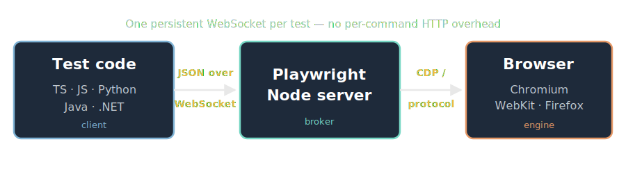
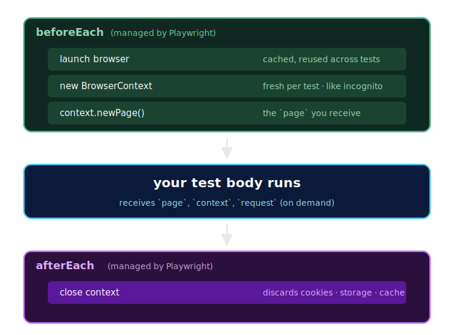

<style>
.reveal pre { width: 100%; box-shadow: none; margin: 12px auto; }
.reveal pre code {
  font-size: 0.68em;
  line-height: 1.4;
  padding: 0.6em 0.9em;
  max-height: 620px;
  border-radius: 6px;
}
.reveal :not(pre) > code { font-size: 0.78em; padding: 2px 6px; }
.reveal table { font-size: 0.55em; margin: 10px auto; }
.reveal table th, .reveal table td { padding: 6px 12px; }
.reveal ul, .reveal ol { font-size: 0.82em; }
.reveal blockquote { font-size: 0.8em; }
.reveal img { max-height: 560px; background: transparent; border: none; box-shadow: none; }
.reveal h2 { margin-bottom: 0.4em; }
.reveal section > p { font-size: 0.85em; }
</style>

# Playwright for SDETs

A complete course, distilled from 15 community sources

Press **S** to open speaker notes · **F** for fullscreen · **?** for help

Note:
Welcome. This deck is the synthesized output of 15 of the most-watched Playwright tutorials on YouTube (~50 hours total), curated into one opinionated curriculum.
Render with: `npx reveal-md ./course.md --watch --separator-vertical "^\n--\n$"`
Prerequisites for the audience: basic JavaScript/TypeScript, async/await, browser DevTools fluency, terminal comfort. No prior automation experience needed.

---

## How this deck is organized

- **18 modules** + **4 appendices**
- JS/TS is the primary track
- Python · Java · .NET → appendices
- Speaker notes cite the source for every claim
- Code fences are first-class — copy and run them

Note:
Each module is one horizontal section. Vertical sub-slides (down arrow) drill into specifics — code, gotchas, alternatives. The course is opinionated: where the corpus disagrees, I picked a side and say why in the notes.

---

## Module 1 — What is Playwright?

- Open-source end-to-end testing framework
- Built and maintained by **Microsoft**
- Originally a fork of **Puppeteer** by ex-Puppeteer engineers
- Tests **modern web apps** (and APIs) in **headed or headless** mode

Note:
Source: Automation Step by Step (Raghav Pal) — "Playwright Beginner Tutorial 1"; Testopic (Victor) — "What is Playwright?". The Puppeteer lineage matters: the team behind Playwright literally built Puppeteer first, then moved to Microsoft. That experience shows in the API.

----

### What you can automate

- Web UI (desktop + mobile browsers)
- REST APIs
- Network interception (mock, modify, record)
- Mobile **emulation** (not real-device native apps)

Note:
Be clear about emulation: Playwright emulates Mobile Chrome and Mobile Safari via viewport + user-agent, but it does *not* drive native iOS/Android apps. For that, look at Appium.

----

### Headline features

- **Cross-browser**: Chromium, Firefox, WebKit
- **Cross-language**: TypeScript/JS, Python, Java, .NET
- **Cross-OS**: Windows, macOS, Linux
- **Auto-wait** + **web-first assertions** = no flaky tests
- Built-in **parallelism**, **HTML reporter**, **trace viewer**

Note:
Every long course in the corpus opens with this list. The combination of auto-wait and retrying assertions is what people mean when they say "no flaky tests" — it eliminates the most common cause of flake (acting before the element is actionable).

----

### Cross-browser, in one API

```ts
// Same test, three engines
test('runs on every browser', async ({ page }) => {
  await page.goto('https://playwright.dev');
  await expect(page).toHaveTitle(/Playwright/);
});
```

Run with `--project=chromium`, `firefox`, or `webkit` — or all three by default.

Note:
WebKit is the engine behind Safari. Playwright ships its own bundled browser binaries — you're not testing against your locally installed Chrome unless you opt in (`channel: 'chrome'`).

----

### What Playwright is *not*

- ❌ A unit-test runner — use Vitest/Jest/pytest for that
- ❌ A native mobile app driver — use Appium
- ❌ A load testing tool — use k6, Locust
- ❌ A replacement for human exploratory testing

Note:
Source: freeCodeCamp — "Software Testing Course". Setting expectations matters; teams that try to do everything in Playwright end up unhappy.

---

## Module 2 — Architecture

How Playwright actually drives a browser

Note:
This module is short but high-leverage — understanding the architecture explains every speed and reliability claim Playwright makes.

----

### The three pieces



- Your code = **client**
- Playwright server = **broker**
- Browser engines spoken to via **CDP** (Chromium) or its protocol-equivalents (Firefox, WebKit)

Note:
Source: Testers Talk (Bakkappa) — "Playwright TypeScript Full Course"; SDET-QA (Pavan). The single WebSocket connection per test is the key architectural detail.

----

### Why it's faster than Selenium

| | Selenium | Playwright |
|---|---|---|
| Wire protocol | W3C over HTTP | CDP over WebSocket |
| Connection lifecycle | Open + close per command | One persistent connection per test |
| Browser drivers | One per browser | None — direct |
| Per-call overhead | ~10-50ms | ~sub-ms |

Note:
Selenium opens a new HTTP connection for every single command. Playwright opens one WebSocket at test start, reuses it for every action, closes it at teardown. That's the dominant reason for the speed difference. Source: Execute Automation — "Playwright vs Selenium".

----

### The interview soundbite

> "Selenium uses W3C protocol with HTTP request/response. Playwright uses WebSocket, has no separate browser drivers, and Playwright itself talks directly to browsers — which is why it's faster."

Note:
This phrasing comes from SDET-QA's Pavan and shows up almost verbatim across multiple courses. Memorize it; it gets asked in interviews.

----

### Practical implications

- Tests **share state** across actions for free (one socket = one session)
- Failures are **easier to trace** (full DOM snapshots, network log)
- **No per-browser driver to manage** — `npm install` ships everything
- Browsers are **bundled and versioned with Playwright** itself

Note:
You're testing against the Chromium nightly that Playwright pinned. That's usually fine, but if you specifically need to validate against the user's Chrome 122, set `channel: 'chrome'`.

---

## Module 3 — Setup

From zero to running test in under 5 minutes

Note:
The whole corpus uses this as Playwright's "wow" moment — every long tutorial spends ~5 minutes on setup and that's it.

----

### Prerequisites

- **Node.js 18+** (LTS recommended) → `nodejs.org`
- **VS Code** → `code.visualstudio.com`
- A terminal you trust

That's it. No JDK, no Maven, no separate test runner.

Note:
Verify with `node -v` and `npm -v` after install. If `node -v` works but `npm -v` doesn't, your PATH is wrong — npm ships with Node.

----

### Two install paths

1. **Command line** (universal, scriptable):
   ```bash
   npm init playwright@latest
   ```
2. **VS Code extension** (interactive, recommended for first time):
   - Install the **Playwright Test for VSCode** extension by Microsoft
   - `Cmd/Ctrl+Shift+P` → **Install Playwright**

Note:
Source: Playwright official channel — "Get Started with Playwright and VS Code (2025)". The extension wraps the CLI but adds a Test Explorer, inline play buttons, Pick Locator, Record at Cursor, and Fix-with-AI. Strongly recommended even if you also know the CLI.

----

### The install wizard's four questions

1. **TypeScript or JavaScript?** → **TypeScript** (recommended)
2. **Where to put end-to-end tests?** → `tests` (default)
3. **Add a GitHub Actions workflow?** → **Yes**
4. **Install Playwright browsers?** → **Yes** (downloads Chromium, Firefox, WebKit)

Note:
TypeScript is the recommended default in 2026. Even if you've never written TS, the autocomplete on Playwright APIs is worth it. The GitHub Actions YAML it generates is also useful even if you're on a different CI — it shows exactly what commands the official template expects.

----

### What got created

```
your-project/
├── .github/workflows/playwright.yml   # CI workflow (if you said yes)
├── node_modules/                       # @playwright/test + browser binaries
├── tests/
│   └── example.spec.ts                 # one sample test
├── tests-examples/
│   └── demo-todo-app.spec.ts           # bigger reference suite
├── package.json
├── package-lock.json
└── playwright.config.ts                # central config
```

Note:
Open `tests-examples/demo-todo-app.spec.ts` and skim it. It's how the Playwright team itself recommends structuring tests — fixtures, POM-ish helpers, parallel-safe data, the works.

----

### Verify

```bash
# from the project root
npx playwright test                # runs example.spec across 3 browsers
npx playwright show-report         # opens the HTML report
```

If all six tests pass (1 sample × Chromium + Firefox + WebKit ≈ 3, but example file has 2 → 6 runs), you're done.

Note:
First run may take 30s as it warms up. Subsequent runs are sub-second per test for trivial cases. Source: SDET-QA, Mukesh, Bakkappa, official channel.

----

### One install command per project

Each project gets its own `node_modules` and Playwright copy. No global install. Versions are pinned in `package.json`.

To upgrade later:
```bash
npm install -D @playwright/test@latest
npx playwright install
```

Note:
Always run `npx playwright install` after upgrading the package — it re-downloads any new browser binaries that the version requires.

---

## Module 4 — Project anatomy

What lives in `playwright.config.ts` and why

Note:
This file is your control center. The defaults are sane, but knowing what's tunable saves hours later.

----

### The shape of `playwright.config.ts`

```ts
import { defineConfig, devices } from '@playwright/test';

export default defineConfig({
  testDir: './tests',
  fullyParallel: true,
  forbidOnly: !!process.env.CI,
  retries: process.env.CI ? 2 : 0,
  workers: process.env.CI ? 1 : undefined,
  reporter: 'html',
  use: { trace: 'on-first-retry' },
  projects: [
    { name: 'chromium', use: { ...devices['Desktop Chrome'] } },
    { name: 'firefox',  use: { ...devices['Desktop Firefox'] } },
    { name: 'webkit',   use: { ...devices['Desktop Safari'] } },
  ],
});
```

Note:
This is verbatim what `npm init playwright@latest` generates. Read it once; you'll edit it dozens of times.

----

### Top-level options you'll touch most

| Option | What it does |
|---|---|
| `testDir` | Where to find specs |
| `timeout` | Per-test timeout (default 30000ms) |
| `expect.timeout` | Per-assertion timeout (default 5000ms) |
| `fullyParallel` | Run tests within a file in parallel |
| `retries` | Auto-retry failed tests N times |
| `workers` | Parallel processes |
| `reporter` | `html`, `list`, `dot`, `json`, `junit`, custom |
| `use` | Global per-test config (browser, viewport, etc.) |

Note:
Source: Bakkappa — "Playwright TypeScript Full Course"; Pavan — "Setup Environment". The two timeouts (test vs assertion) trip up beginners — assertions retry within their timeout, but they can't exceed the test timeout.

----

### The `use` block — defaults for every test

```ts
use: {
  baseURL: 'http://localhost:3000',
  trace: 'on-first-retry',
  screenshot: 'only-on-failure',
  video: 'retain-on-failure',
  headless: true,
  viewport: { width: 1280, height: 720 },
  actionTimeout: 10_000,
  locale: 'en-US',
  timezoneId: 'America/New_York',
}
```

Note:
`baseURL` lets you write `page.goto('/login')` instead of full URLs. `trace: 'on-first-retry'` is the canonical setting — generate a trace only when something fails, not every run. Source: official docs + Mukesh.

----

### Projects = browser × config matrix

```ts
projects: [
  { name: 'chromium',  use: { ...devices['Desktop Chrome'] } },
  { name: 'firefox',   use: { ...devices['Desktop Firefox'] } },
  { name: 'webkit',    use: { ...devices['Desktop Safari'] } },
  { name: 'mobile',    use: { ...devices['iPhone 13'] } },
  { name: 'branded',   use: { channel: 'chrome' } },  // real Chrome
],
```

Each test runs once **per project** by default. Three projects × 10 tests = 30 runs.

Note:
Comment out projects you don't need locally to speed up dev cycles. CI should run the full matrix. The `devices` import has presets for iPhones, Pixels, iPads, etc.

----

### Web server: spin up your app automatically

```ts
webServer: {
  command: 'npm run dev',
  url: 'http://localhost:3000',
  reuseExistingServer: !process.env.CI,
  timeout: 120_000,
}
```

Now `npx playwright test` starts your dev server, waits for the URL to respond, runs tests, then shuts down.

Note:
This is one of the most underrated features. Combined with `baseURL`, your tests become environment-agnostic. Source: Cosden Solutions — "React Testing with Playwright" (mentions it but doesn't demo); official docs.

----

### `package.json` scripts to add

```json
{
  "scripts": {
    "test": "playwright test",
    "test:headed": "playwright test --headed",
    "test:ui": "playwright test --ui",
    "test:debug": "playwright test --debug",
    "test:report": "playwright show-report"
  }
}
```

Note:
Saves typing `npx` everywhere. Match the names other team conventions in your repo.

---

## Module 5 — Your first test

The minimum viable Playwright test, line by line

Note:
We'll build it from scratch, then explain every keyword.

----

### Anatomy of a spec file

```ts
import { test, expect } from '@playwright/test';

test('homepage has the right title', async ({ page }) => {
  await page.goto('https://playwright.dev');
  await expect(page).toHaveTitle(/Playwright/);
});
```

Five things to notice → next slide.

Note:
Every Playwright test in JS/TS has this exact shape. If you can read this slide, you can read 95% of any Playwright codebase.

----

### What's happening

1. **`import { test, expect }`** — both come from `@playwright/test`
2. **`test('title', async ({ page }) => {...})`** — declares one test
3. **`async`** — required because Playwright APIs return Promises
4. **`{ page }`** — destructured *fixture* (a managed `Page` object)
5. **`await`** — wait for the Promise; required on every Playwright call

Note:
The fixture pattern is critical. Playwright creates a brand-new browser context and page for *every test*, in isolation, then disposes it. You don't manage lifecycle — the runner does. Source: Pavan — "Setup Environment".

----

### `async`/`await` primer

```ts
// ❌ Wrong: forgot await — page.goto returns a Promise
test('bad', async ({ page }) => {
  page.goto('https://example.com');     // fires, doesn't wait
  await expect(page).toHaveTitle('...'); // runs against blank page
});

// ✅ Right: await every Playwright call
test('good', async ({ page }) => {
  await page.goto('https://example.com');
  await expect(page).toHaveTitle('...');
});
```

Note:
The single most common beginner bug. TypeScript will warn you (`Promise<void> is not assignable to void`); JavaScript silently breaks. This alone is reason enough to use TypeScript.

----

### Two assertion styles

```ts
// Web-first (recommended) — auto-retries until expect.timeout
await expect(page).toHaveTitle(/Playwright/);
await expect(page.getByRole('heading')).toBeVisible();

// Plain (only for non-DOM values)
const count = await page.locator('.row').count();
expect(count).toBe(5);
```

**Rule:** if the value comes from the page, use the web-first form.

Note:
Web-first assertions retry the underlying check (visibility, text, count) until it passes or the timeout expires. Plain `expect(value).toBe(x)` is a one-shot comparison — if `count` was wrong by 1ms, you lose. Source: Bakkappa, Zeeshan, Kaushik (TS).

----

### Run it

```bash
npx playwright test                     # all tests, all projects, headless
npx playwright test --headed            # see the browsers
npx playwright test homepage.spec.ts    # one file
npx playwright test -g "right title"    # by test title (substring)
npx playwright show-report              # open HTML report
```

Note:
`-g` is `--grep` — substring match against the test title, not file name. Source: Pavan, Mukesh, Bakkappa — they all teach the same flag set.

----

### The `page` fixture's lifecycle



Note:
Every test gets a brand-new context, which means brand-new cookies, localStorage, and cache. This isolation is why Playwright tests don't leak state into each other. Source: Kaushik (TS) — "Playwright with TypeScript".

----

### Multiple tests in one file

```ts
import { test, expect } from '@playwright/test';

test('homepage loads', async ({ page }) => { /* ... */ });
test('login works',    async ({ page }) => { /* ... */ });
test('cart adds item', async ({ page }) => { /* ... */ });
```

Each runs in isolation. Order is not guaranteed (they may run in parallel).

Note:
Don't write tests that depend on order. If you need shared setup, use `beforeEach` (covered in Module 10) or `globalSetup` for once-per-suite work.

---

## Module 6 — Running tests

Every CLI flag you'll actually use

Note:
The CLI is small and stable. Memorize ten flags and you're set for the rest of your career.

----

### The ten flags you need

| Command | Does |
|---|---|
| `npx playwright test` | Run everything |
| `npx playwright test login.spec.ts` | One file |
| `npx playwright test -g "smoke"` | Filter by title substring |
| `npx playwright test --project=chromium` | One browser |
| `npx playwright test --headed` | Visible browsers |
| `npx playwright test --debug` | Inspector + paused |
| `npx playwright test --ui` | Interactive runner |
| `npx playwright test --workers=4` | Parallel |
| `npx playwright test --repeat-each=3` | Stability check |
| `npx playwright test --last-failed` | Only tests that failed last run |

Note:
`--last-failed` is the killer feature for triaging — fix one thing, re-run only the broken tests. Source: Pavan, Bakkappa.

----

### Headless vs headed vs UI mode

| Mode | Command | Use when |
|---|---|---|
| **Headless** (default) | `playwright test` | CI, fast iteration |
| **Headed** | `playwright test --headed` | "Why isn't this clicking?" |
| **UI mode** | `playwright test --ui` | Active development, watch mode |
| **Debug** | `playwright test --debug` | Step through one test |

Note:
UI mode is the daily-driver. It has watch mode, time-travel through actions, picks locators, shows network and console — basically the trace viewer attached to a runner. Once you try it you won't go back.

----

### UI mode tour

- Top: **action timeline** with screenshots before/after each step
- Left: **test tree** — pick what to run, toggle watch mode
- Right tabs: **Locator** picker · **Network** · **Console** · **Source** · **Errors** · **Attachments**

```bash
npx playwright test --ui
```

Note:
Click on any past action and the page re-renders to that exact moment — the DOM, network state, console, everything. This is the same Trace Viewer from Module 12, just live.

----

### The HTML report

```bash
npx playwright show-report
```

- Pass/fail/flaky/skipped counts
- Per-browser breakdown
- Per-test step list with timing
- Embedded screenshots, videos, traces (if configured)
- Direct links into Trace Viewer

Note:
The default report is good enough that most teams never need Allure. We'll cover Allure in Module 19 only because some shops require it for historical trends.

----

### Headed isn't always a debug tool

```ts
// playwright.config.ts
use: {
  headless: false,
  launchOptions: { slowMo: 500 },  // 500ms between actions
}
```

`slowMo` only works in headed mode. Useful for demos and screen recordings.

Note:
Source: Kaushik (TS) — uses `slowMo: 1000` for tutorial recordings. Don't ship this to CI; it just makes tests slow without making them more reliable.

---

## Module 7 — Locators

How to find elements on the page (the most important skill)

Note:
Get this module right and you'll never write a flaky test. Get it wrong and nothing else helps.

----

### The recommended hierarchy

Prefer locators that mirror what users see and screen readers announce:

1. **`getByRole`** — by ARIA role + accessible name
2. **`getByLabel`** — form fields by their `<label>`
3. **`getByPlaceholder`** — inputs by placeholder text
4. **`getByText`** — by visible text content
5. **`getByAltText`** — images by `alt`
6. **`getByTitle`** — by `title` attribute
7. **`getByTestId`** — by `data-testid` (when nothing semantic fits)

Then, only as a fallback: **CSS** and **XPath**.

Note:
Source: every long course in the corpus, all in agreement. The order matters — earlier locators are stable across UI redesigns; CSS/XPath break the moment a developer rearranges the DOM.

----

### `getByRole` — the workhorse

```ts
await page.getByRole('button', { name: 'Sign in' }).click();
await page.getByRole('link',   { name: 'Pricing' }).click();
await page.getByRole('heading', { name: 'Welcome', level: 1 });
await page.getByRole('textbox', { name: 'Email' }).fill('a@b.c');
```

Common roles: `button`, `link`, `heading`, `textbox`, `checkbox`, `radio`, `combobox`, `dialog`, `list`, `listitem`.

Note:
The `name` is the *accessible name* — what a screen reader would announce. For buttons it's the visible text; for inputs it's the associated label. Source: Bakkappa, Zeeshan, official docs.

----

### `getByLabel` — form fields

```html
<label for="email">Email</label>
<input id="email" type="email">
```

```ts
await page.getByLabel('Email').fill('user@example.com');

// Exact match when labels overlap (e.g. "Password" + "Password Confirm")
await page.getByLabel('Password', { exact: true }).fill('hunter2');
```

Note:
Pass `{ exact: true }` whenever a longer label might match — `Password` would otherwise match `Password Confirm` too and trigger strict-mode violation.

----

### `getByText` — visible text

```ts
await page.getByText('Sign in').click();                    // partial match
await page.getByText('Sign in', { exact: true }).click();   // exact

// Regex
await page.getByText(/welcome.*back/i).click();

// Text inside a specific container
await page.getByRole('article').getByText('Read more').click();
```

Note:
`getByText` is great for buttons, links, headings. Avoid for body paragraphs that change wording often.

----

### `getByTestId` — escape hatch

```html
<ul data-testid="items-list">...</ul>
```

```ts
await expect(page.getByTestId('items-list')).toBeEmpty();
```

Configure the attribute name in `playwright.config.ts`:
```ts
use: { testIdAttribute: 'data-cy' }   // if you migrated from Cypress
```

Note:
Use `data-testid` only when no semantic locator works. It's reliable but invisible to users — every team should agree on a naming convention. Source: Cosden, Bakkappa.

----

### CSS and XPath — when semantics fail

```ts
// CSS (default — no prefix needed)
await page.locator('input[name="search"]').fill('playwright');
await page.locator('.product-card:nth-of-type(3)');

// XPath (Playwright auto-detects when string starts with //)
await page.locator('//button[normalize-space()="Sign in"]');
await page.locator('xpath=//div[contains(@class,"alert")]');
```

**Use sparingly.** They break on DOM redesigns.

Note:
The SelectorsHub Chrome extension generates and validates CSS/XPath selectors live in the page — invaluable for legacy apps with no semantic markup. Source: Mukesh, Zeeshan, Kaushik.

----

### Pick Locator (interactive)

In **VS Code Test Explorer** → **Pick Locator** button:

1. Click the button
2. Hover any element in the running browser
3. Playwright shows the recommended locator
4. Click to copy it into your code

Or programmatically: `await page.pause()` then click the **Pick Locator** button in the Inspector.

Note:
Pick Locator always prefers the highest-stability locator (role > label > text > testid > css). Trust its choice unless you have a specific reason. Source: official channel — VS Code 2025 video.

----

### Strict mode (and how to escape it)

Locators are **strict by default** — matching multiple elements throws:

```
Error: locator.click: strict mode violation: getByRole('button')
       resolved to 5 elements
```

Fixes:

```ts
await page.getByRole('button').first().click();
await page.getByRole('button').last().click();
await page.getByRole('button').nth(2).click();  // 0-indexed
await page.getByRole('button', { name: 'Specific' }).click();  // tighten
```

Note:
Strict mode is a feature, not a bug. It catches the case where your locator was accidentally too broad and you'd silently click the wrong thing. Source: Kaushik (TS).

----

### Chaining locators

```ts
// "Find the article whose heading says 'Build', then click its 'Buy' button"
await page
  .getByRole('article')
  .filter({ hasText: 'Build with confidence' })
  .getByRole('button', { name: 'Buy' })
  .click();
```

Note:
This is the pattern for working with lists of similar items (cards, rows, list items). Far more robust than `nth()`.

----

### The `.filter()` method

```ts
// By text content
page.getByRole('listitem').filter({ hasText: 'Cheese' });

// By having a child
page.getByRole('listitem').filter({ has: page.getByRole('button', { name: 'Add' }) });

// By NOT having something
page.getByRole('listitem').filter({ hasNotText: 'Out of stock' });
```

Note:
`.filter()` operates on the *match set*. Combine with chaining for surgical precision. This is the Playwright equivalent of XPath predicates.

----

### Locating in iframes

```ts
const frame = page.frameLocator('iframe#payment');
await frame.getByLabel('Card number').fill('4242 4242 4242 4242');

// Nested iframes — chain
const inner = frame.frameLocator('iframe.inner');
await inner.locator('button').click();
```

Note:
There is no `switchToFrame` like Selenium. `frameLocator` is just another locator that scopes everything inside it. Source: Kaushik, Mukesh, Bakkappa — all teach the same shape.

----

### Locating in Shadow DOM

Just use any locator. Playwright **pierces shadow boundaries automatically.**

```ts
await page.getByRole('button', { name: 'Submit' }).click();
// works whether the button is in light DOM or inside <shadow-root>
```

Note:
This is genuinely a superpower vs Selenium and Cypress. No special API, no `shadow$`. Source: Kaushik (TS).

----

### Locator gotchas

- `page.locator(...)` is **lazy** — no DOM query happens until you act
- Reusing a locator variable is fine (and recommended)
- Don't mix `await` and locator construction:
  ```ts
  const btn = page.getByRole('button');         // ✅ no await
  await btn.click();                            // ✅ await on action
  ```
- `count()`, `textContent()`, `getAttribute()` all need `await`

Note:
The lazy semantics mean you can declare locators at the top of a test and use them even if the element doesn't exist yet — Playwright resolves them just-in-time, with auto-wait.

---

## Module 8 — Actions

Click, fill, type, hover, drag, keyboard, mouse, file upload

Note:
All actions follow the same pattern: locator → action. All actions auto-wait. All actions return Promises.

----

### Click variants

```ts
await locator.click();                          // standard left click
await locator.click({ button: 'right' });       // right click
await locator.click({ button: 'middle' });      // middle (opens new tab)
await locator.dblclick();                       // double click
await locator.click({ modifiers: ['Shift'] });  // Shift+click
await locator.click({ position: { x: 5, y: 5 } }); // offset
await locator.click({ force: true });           // skip actionability checks
```

Note:
`force: true` bypasses Playwright's actionability checks (visible, stable, enabled, receives events). Use as a last resort — it's almost always masking a real bug in your selector or your app.

----

### Fill vs type — the critical distinction

```ts
// fill — clears existing value, sets new value instantly, no key events
await page.getByLabel('Email').fill('a@b.c');

// type — types character by character, fires keydown/keypress/input events
await page.getByLabel('Search').type('hello', { delay: 100 });

// pressSequentially — newer alias for type with explicit per-char semantics
await page.getByLabel('Search').pressSequentially('hello', { delay: 100 });
```

**Rule:** use `fill` unless input listeners require per-character events.

Note:
Source: Kaushik (TS), Mukesh, Bakkappa — universal consensus. `type` is much slower; `fill` is what you want 95% of the time. Use `pressSequentially` in new code (Playwright is migrating toward it).

----

### Checkboxes and radios

```ts
const agree = page.getByLabel('I agree');

await agree.check();                  // ensure checked (no-op if already)
await agree.uncheck();                // ensure unchecked
await expect(agree).toBeChecked();
await expect(agree).not.toBeChecked();
```

Use `check()`/`uncheck()` instead of `click()` — idempotent, intent-revealing.

Note:
`click()` works too but flips state regardless of current state. `check()` is a no-op if the box is already checked, which is what you usually want.

----

### Native `<select>` dropdowns

```ts
const month = page.getByLabel('Month');

await month.selectOption('March');                // by label or value
await month.selectOption({ value: 'mar' });       // by value
await month.selectOption({ index: 2 });           // by index
await month.selectOption({ label: 'March' });     // by label
await month.selectOption(['Mar', 'Apr', 'May']);  // multi-select
```

Note:
Since 1.29, `selectOption('March')` matches by label *or* value. Source: Bakkappa, Mukesh.

----

### Custom (non-native) dropdowns

```ts
// Bootstrap/jQuery dropdowns are just clickable divs
await page.locator('.dropdown-trigger').click();
await page.getByRole('option', { name: 'United Kingdom' }).click();
```

Or wrap it in a helper:

```ts
async function selectCountry(page: Page, country: string) {
  await page.locator('.country-dropdown').click();
  await page.getByRole('listbox').getByText(country).click();
}
```

Note:
There's no API for "fake" dropdowns because they're just divs. Pattern: open → wait for options → click the right one. Source: Kaushik, Mukesh.

----

### Hover

```ts
await page.getByRole('navigation').getByText('Products').hover();
await page.getByRole('menuitem', { name: 'Pricing' }).click();
```

Hover triggers the actionability checks (attached, visible, stable). Pair with `getByRole` for menus.

Note:
Codegen does *not* record hovers — you'll need to add them by hand for menu interactions. Source: Mukesh, Kaushik.

----

### Drag and drop

```ts
const source = page.getByText('Drag me');
const target = page.getByText('Drop here');

await source.dragTo(target);

// Or low-level
await source.hover();
await page.mouse.down();
await target.hover();
await page.mouse.up();
```

Note:
`dragTo` works for HTML5 drag-and-drop and most modern libraries. The low-level path is for when frameworks need precise mouse events.

----

### Keyboard

```ts
await page.keyboard.press('Enter');
await page.keyboard.press('Control+A');     // Windows/Linux
await page.keyboard.press('Meta+A');        // macOS
await page.keyboard.type('hello world');    // free typing into focused element

// Focused-element shortcut
await locator.press('Tab');

// Hold and release
await page.keyboard.down('Shift');
await page.keyboard.press('ArrowRight');
await page.keyboard.press('ArrowRight');
await page.keyboard.up('Shift');
```

Note:
Use `Meta` for Mac's Cmd, `Control` for Windows/Linux. For cross-platform tests, use `process.platform === 'darwin' ? 'Meta+A' : 'Control+A'` or wrap in a helper. Source: Mukesh, Bakkappa.

----

### Mouse (low-level)

```ts
await page.mouse.move(100, 200);
await page.mouse.down();
await page.mouse.move(300, 400);  // drag
await page.mouse.up();

await page.mouse.wheel(0, 500);   // scroll down 500px
```

Use only when locator-based actions don't fit.

Note:
99% of tests should never touch `page.mouse`. Reach for it for canvas interactions, custom drag implementations, or scroll-triggered behavior.

----

### File upload

```ts
// Standard <input type="file">
await page.getByLabel('Avatar').setInputFiles('./fixtures/avatar.png');

// Multiple files
await page.getByLabel('Photos').setInputFiles([
  './fixtures/a.png',
  './fixtures/b.png',
]);

// Clear selection
await page.getByLabel('Avatar').setInputFiles([]);

// In-memory (no file on disk)
await page.getByLabel('Avatar').setInputFiles({
  name: 'avatar.png',
  mimeType: 'image/png',
  buffer: Buffer.from('...'),
});
```

Note:
**Don't click the file input.** That opens the OS file picker, which Playwright cannot drive. Always use `setInputFiles` directly on the input. Source: Mukesh, Kaushik, Bakkappa.

----

### When the file input is hidden

```ts
const [chooser] = await Promise.all([
  page.waitForEvent('filechooser'),
  page.getByText('Upload').click(),  // the visible button that opens the chooser
]);
await chooser.setFiles('./fixtures/document.pdf');
```

Note:
Many modern apps hide the real `<input type="file">` and show a styled button. The `filechooser` event fires when the OS dialog would open; you intercept it. Source: Kaushik (TS), Mukesh.

----

### File download

```ts
const [download] = await Promise.all([
  page.waitForEvent('download'),
  page.getByText('Export CSV').click(),
]);

console.log(download.suggestedFilename());
await download.saveAs('./downloads/export.csv');
```

Note:
Downloads are deleted when the context closes — `saveAs` persists them. Always run inside `Promise.all` to avoid race conditions.

----

### Scroll

```ts
await locator.scrollIntoViewIfNeeded();   // intent: make element visible
await page.mouse.wheel(0, 500);           // pixel-precise scroll
await page.evaluate(() => window.scrollTo(0, document.body.scrollHeight));
```

Note:
Most actions auto-scroll to the element first. Manual scrolling is usually only needed for infinite-scroll testing or visibility checks of off-screen content.

---

## Module 9 — Web-first assertions

Auto-retrying assertions, the "no-flaky" superpower

Note:
Get this module right and 80% of your flake disappears.

----

### Web-first vs plain — recap

```ts
// ✅ Web-first: retries until expect.timeout (default 5s)
await expect(page.getByText('Welcome')).toBeVisible();

// ❌ Plain: one-shot snapshot, no retry
const isVisible = await page.getByText('Welcome').isVisible();
expect(isVisible).toBe(true);
```

The first form retries automatically. The second is a race.

Note:
The naming pattern: `await expect(locator).toXxx(...)` always retries. `expect(value).toXxx(...)` does not. Memorize that one rule.

----

### Visibility / state matchers

```ts
await expect(locator).toBeVisible();
await expect(locator).toBeHidden();
await expect(locator).toBeEnabled();
await expect(locator).toBeDisabled();
await expect(locator).toBeEditable();
await expect(locator).toBeChecked();
await expect(locator).toBeFocused();
await expect(locator).toBeEmpty();
await expect(locator).toBeAttached();   // in DOM (visible or not)
await expect(locator).toBeInViewport();
```

Note:
These are the day-to-day checks. Each retries until true or timeout.

----

### Content matchers

```ts
await expect(locator).toHaveText('exact match');
await expect(locator).toHaveText(/regex/);
await expect(locator).toContainText('substring');
await expect(locator).toHaveValue('input value');
await expect(locator).toHaveAttribute('href', '/profile');
await expect(locator).toHaveClass(/active/);
await expect(locator).toHaveCount(3);
await expect(locator).toHaveCSS('color', 'rgb(255, 0, 0)');
```

Note:
`toHaveText` is exact match; `toContainText` is substring. `toHaveCount` is invaluable — it retries the count, so you can assert "exactly 5 rows" without race conditions.

----

### Page-level matchers

```ts
await expect(page).toHaveTitle('Dashboard');
await expect(page).toHaveURL('/dashboard');
await expect(page).toHaveURL(/\/dashboard$/);
await expect(page).toHaveScreenshot('dashboard.png');  // visual
```

Note:
`toHaveScreenshot` is for visual regression — Module 17. The URL/title matchers are the most-used pair after `toBeVisible`.

----

### Negation with `.not`

```ts
await expect(locator).not.toBeVisible();
await expect(locator).not.toHaveText('Error');
await expect(page).not.toHaveURL('/login');
```

Available on every web-first matcher.

Note:
`.not` also retries — it waits until the condition becomes false (or until timeout if it never does).

----

### Soft assertions — collect all failures

```ts
test('checkout page', async ({ page }) => {
  await page.goto('/checkout');

  await expect.soft(page.getByText('Subtotal')).toBeVisible();
  await expect.soft(page.getByText('Tax')).toBeVisible();
  await expect.soft(page.getByText('Total')).toBeVisible();

  // Test continues even if individual asserts above fail.
  // The test still fails at the end, but you see all errors.
});
```

Note:
Useful for asserting many independent things. With hard `expect`, the first failure stops the test and you don't know what else was broken. Source: Kaushik (TS), Bakkappa.

----

### Custom timeouts — per-assertion override

```ts
// Slow network — wait longer for this one assertion
await expect(page.getByText('Loaded')).toBeVisible({ timeout: 30_000 });

// Quick check — don't waste 5 seconds on a probably-true assertion
await expect(page.getByText('OK')).toBeVisible({ timeout: 1_000 });
```

Defaults: `expect.timeout` 5s, `actionTimeout` 0 (unlimited), `timeout` 30s per test.

Note:
Per-assertion timeouts are the right place for "I know this is slow" exceptions. Don't bump the global default unless your whole app is slow.

----

### Assertions cheat sheet

| Want to assert | Use |
|---|---|
| Element is on screen | `toBeVisible()` |
| Element exists in DOM | `toBeAttached()` |
| Form input has value | `toHaveValue('x')` |
| Element shows specific text | `toHaveText('x')` or `toContainText('x')` |
| Locator matches N elements | `toHaveCount(N)` |
| URL changed | `toHaveURL(...)` |
| Network call returned | `expect(response.status()).toBe(200)` (Module 13) |

Note:
Print this and pin it. Source: official docs + every long course in the corpus.

---

## Module 10 — Hooks & test organization

`describe`, `beforeEach`, tags, retries, repeat

Note:
The runner has surprisingly few primitives. They compose into everything you need.

----

### Hooks

```ts
test.beforeAll(async () => {
  // once before any test in the file
});

test.beforeEach(async ({ page }) => {
  // before every test — typically auth/navigation
  await page.goto('/');
});

test.afterEach(async ({ page }) => {
  // after every test — cleanup
});

test.afterAll(async () => {
  // once after all tests
});
```

Note:
`beforeAll`/`afterAll` cannot use the `page` fixture — the fixture is per-test, not per-file. Use them for shared resource setup (DB seed, API token).

----

### `describe` for grouping

```ts
test.describe('checkout', () => {
  test.beforeEach(async ({ page }) => {
    await page.goto('/cart');
  });

  test('valid card succeeds', async ({ page }) => { /* ... */ });
  test('expired card fails', async ({ page }) => { /* ... */ });
});
```

`describe`-scoped hooks only fire for tests inside that block.

Note:
Group by feature, not by mechanism. "checkout" is a feature; "click tests" is not.

----

### Tags for selective runs

```ts
test('login basic', { tag: '@smoke' }, async ({ page }) => {});
test('login MFA',   { tag: ['@smoke', '@regression'] }, async ({ page }) => {});

// Run by tag
// $ npx playwright test --grep @smoke
// $ npx playwright test --grep "@regression|@p0"
```

Note:
Common tag schemes: `@smoke`, `@regression`, `@p0`/`@p1`/`@p2`, `@flaky`, `@slow`. Document your team's conventions.

----

### Skip, only, fixme, fail

```ts
test.skip('not yet implemented', async ({ page }) => {});
test.skip(browserName === 'webkit', 'WebKit bug #123');

test.only('focused test for debugging', async ({ page }) => {});

test.fixme('known broken, do not run', async ({ page }) => {});
test.fail('expected to fail until fix lands', async ({ page }) => {});
```

`forbidOnly: true` in CI prevents accidentally committed `.only`.

Note:
`test.only` is for development only. Set `forbidOnly: !!process.env.CI` so your CI pipeline fails if `.only` slips through code review.

----

### Retries

```ts
// playwright.config.ts
retries: process.env.CI ? 2 : 0,
```

A test that passes only on retry is marked **flaky** in the report — track and fix these.

Note:
Local: 0 retries (flake should be visible immediately while you can debug). CI: 2 retries (network blips happen). Don't go higher; if a test needs 3+ retries, it's broken.

----

### Repeat — stability check

```bash
npx playwright test login.spec.ts --repeat-each=20
```

Run the same test 20 times. If even one fails, you have flake to fix.

Note:
The single best technique for finding flake before it hits CI. Run on the highest worker count your machine handles.

----

### Conditional skips

```ts
test('only on mobile', async ({ page, isMobile }) => {
  test.skip(!isMobile, 'mobile-only feature');
  // ...
});

test.skip(({ browserName }) => browserName === 'firefox', 'Firefox bug');
```

Note:
Per-test conditional skips beat duplicate test files. The runner's reporting reflects "skipped because X" so you don't lose visibility.

----

### `test.step` for readable reports

```ts
test('checkout flow', async ({ page }) => {
  await test.step('add item to cart', async () => {
    await page.getByRole('button', { name: 'Add' }).click();
  });

  await test.step('proceed to checkout', async () => {
    await page.getByRole('link', { name: 'Checkout' }).click();
  });

  await test.step('enter payment', async () => {
    await page.getByLabel('Card').fill('4242...');
  });
});
```

The HTML report shows each step as its own collapsible block.

Note:
Highly recommended for any test longer than ~5 actions. Failure reports become 10x more useful.

---

## Module 11 — Tricky UI patterns

Iframes, dialogs, popups, dates, networking

Note:
Every real app has at least three of these. Master the patterns once.

----

### Native dialogs (alert, confirm, prompt)

```ts
page.on('dialog', async dialog => {
  console.log(dialog.type());      // 'alert' | 'confirm' | 'prompt'
  console.log(dialog.message());
  await dialog.accept('input text'); // text is for prompts only
  // or: await dialog.dismiss();
});

await page.getByRole('button', { name: 'Delete' }).click();
```

**Register the listener BEFORE triggering the dialog.**

Note:
Without a registered listener, Playwright auto-dismisses dialogs. That's usually what you want, but if you need to assert on the message, register first. Source: Mukesh, Kaushik, Bakkappa.

----

### `once` vs `on`

```ts
// Handle only the next dialog
page.once('dialog', async d => await d.accept());

// Handle every dialog for the session
page.on('dialog', async d => await d.accept());
page.off('dialog', handler);  // remove
```

Note:
Prefer `once` — you usually want to handle exactly one dialog per action. `on` handlers leak across tests if you forget to clean up.

----

### iframes

```ts
const frame = page.frameLocator('iframe[name="payment"]');
await frame.getByLabel('Card number').fill('4242 4242 4242 4242');
await frame.getByLabel('CVV').fill('123');

// Nested
const inner = frame.frameLocator('iframe.confirm');
await inner.getByRole('button', { name: 'Pay' }).click();
```

Note:
`frameLocator` is just another locator — chain it like any other. No "switch back to parent" needed; `page` always refers to the top-level document.

----

### New tabs and popups

```ts
const [newPage] = await Promise.all([
  page.context().waitForEvent('page'),
  page.getByRole('link', { name: 'Open in new tab' }).click(),
]);

await newPage.waitForLoadState();
await expect(newPage).toHaveTitle('External');
```

Note:
`Promise.all` is required to avoid a race — register the listener and trigger the action atomically. Source: Mukesh, Kaushik, Bakkappa.

----

### Multiple windows at once

```ts
await page.getByRole('button', { name: 'Open all' }).click();
await page.waitForTimeout(1000);  // give the popups a moment

const allPages = page.context().pages();
for (const p of allPages) {
  console.log(await p.title());
}
```

Note:
`context().pages()` returns every open page in the current browser context. Useful for multi-window flows like OAuth callbacks (though for OAuth you usually stub the callback URL).

----

### Date pickers — three patterns

```ts
// 1. Native <input type="date"> — just fill
await page.getByLabel('Birthday').fill('1990-12-04');

// 2. Custom calendar — click through
await page.getByLabel('Date').click();
await page.getByRole('button', { name: 'Next month' }).click();
await page.getByRole('button', { name: '15' }).click();

// 3. Custom calendar with arbitrary offsets
const target = new Date();
target.setDate(target.getDate() + 7);  // 7 days from today
const day = target.getDate().toString();
await page.getByRole('gridcell', { name: day }).click();
```

Note:
For complex date pickers, write a `selectDate(targetDate)` helper that handles month/year navigation. Source: Kaushik (TS).

----

### Waiting for the network

```ts
// Wait until no network requests for 500ms
await page.waitForLoadState('networkidle');

// Wait for a specific request
await page.waitForResponse(resp => resp.url().includes('/api/users'));

// Wait for a request to be triggered
await page.waitForRequest(req => req.method() === 'POST' && req.url().includes('/api/cart'));
```

Note:
Use `networkidle` for SPAs that load content via XHR. Use `waitForResponse` when you need to assert on the response or wait for a specific call.

----

### Avoid `waitForTimeout`

```ts
// ❌ Don't
await page.waitForTimeout(2000);

// ✅ Do — wait for what you actually need
await expect(page.getByText('Loaded')).toBeVisible();
await page.waitForLoadState('networkidle');
```

Hard sleeps are flaky, slow, and lie about your actual wait conditions.

Note:
Universal consensus across the corpus. The only exception: tutorial screencasts where `waitForTimeout` slows things down for the camera. Source: every long course.

----

### Wait for selector — legacy

```ts
// Old style (still works)
await page.waitForSelector('.spinner', { state: 'hidden' });

// Modern equivalent
await expect(page.locator('.spinner')).toBeHidden();
```

Prefer the assertion form — same retry semantics, better failure messages.

Note:
You'll see `waitForSelector` in older tutorials. New code should use `expect(locator).toBeXxx()` instead.

---

## Module 12 — Debugging

Trace Viewer, UI mode, Codegen, Record-at-Cursor, Fix-with-AI

Note:
The single most underrated module. Master these tools and your debug time drops by an order of magnitude.

----

### The Trace Viewer

Enable in config:
```ts
use: { trace: 'on-first-retry' }   // 'on' | 'off' | 'retain-on-failure'
```

After a test runs, the HTML report links into a Trace Viewer page that has:
- **Action timeline** with screenshots before/after each step
- **DOM snapshots** — interactive, you can hover and inspect
- **Network panel** — every request, headers, body, timing
- **Console panel** — every console.log and error
- **Source** — your test code with the active line highlighted

Note:
Source: every course. The Playwright team considers Trace Viewer the killer feature, and the corpus agrees. Always enable `on-first-retry` minimum.

----

### Opening a trace from CLI

```bash
npx playwright show-trace path/to/trace.zip
```

Or upload to **trace.playwright.dev** for a hosted viewer (no install needed).

Note:
trace.playwright.dev is great for sharing traces with teammates who don't have Playwright installed locally.

----

### UI mode — the daily driver

```bash
npx playwright test --ui
```

What you get:
- Watch mode (auto re-run on save)
- Time-travel debugging (click any past action, see the page state)
- Pick locator inline
- Filter by name, status, browser
- Same panels as Trace Viewer

Note:
If you take one thing from this module: use UI mode for development. Source: Bakkappa, Pavan, official channel.

----

### Inspector / debug mode

```bash
npx playwright test login.spec.ts --debug
```

Pauses before the test starts. Then:
- Step over each line
- Inspect locators (Pick Locator button)
- Modify and re-run
- See the live DOM and the action queue

Note:
Different from UI mode — Inspector is for stepping through one specific test, line by line. UI mode is for running and re-running many tests interactively.

----

### Codegen — record actions

```bash
npx playwright codegen https://example.com
npx playwright codegen --target=python
npx playwright codegen --output=tests/recorded.spec.ts
```

Open a browser, click around, watch your test get written for you.

Note:
Codegen is great as a starting point. It picks the most semantic locator available (`getByRole`, `getByLabel`, etc.). Don't ship Codegen output as-is — refactor for clarity and reuse. Source: Mukesh, Bakkappa, Kaushik (all agree).

----

### Record at Cursor

In VS Code with the extension installed:

1. Open a spec file
2. Place cursor where you want new actions
3. Click **Record at Cursor** in the Testing panel
4. Perform actions in the browser
5. Code appears at your cursor position

Note:
Best feature for incrementally extending a test. Avoids the "regenerate the whole thing" trap.

----

### Pick Locator (recap)

In the Testing sidebar or Inspector:
1. Click **Pick Locator**
2. Hover any element in the running browser
3. The recommended locator appears
4. Click to copy

Use this constantly. Don't write locators by hand if Pick Locator can give you one.

Note:
Pick Locator implements the recommended hierarchy — you get `getByRole` first, `data-testid` last, CSS only as a fallback. Source: official channel — VS Code 2025.

----

### Fix with AI (sparkles icon)

When a test fails in the Test Explorer:
1. Click the ✨ **Fix with AI** icon next to the failed test
2. The extension sends the failure context to your configured LLM
3. Suggested code change appears as a diff
4. Accept or reject

Works with GitHub Copilot, GPT-4, Claude — whatever you have configured in VS Code.

Note:
Best for selector drift (an ID changed, an element moved). Less useful for logic bugs. Always read the diff before accepting. Source: official channel.

----

### `page.pause()` for ad-hoc inspection

```ts
test('investigate', async ({ page }) => {
  await page.goto('/dashboard');
  await page.pause();   // opens Inspector, freezes test
  // continue stepping in the UI
});
```

The test halts; the Inspector opens; you can pick locators, step through, modify and resume.

Note:
The fastest way to debug a single test you're actively writing. Don't commit `pause()` calls.

----

### Headed + slowMo for screencasts

```ts
// playwright.config.ts
use: {
  headless: false,
  launchOptions: { slowMo: 1000 },
}
```

Each action waits 1s. Useful for demos, useless for CI.

Note:
Source: Kaushik (TS) — uses this for tutorial recordings.

---

## Module 13 — API testing & mocking

The `request` fixture and `page.route()`

Note:
Playwright is genuinely good at API testing. Often better than reaching for a separate tool.

----

### The `request` fixture

```ts
import { test, expect } from '@playwright/test';

test('GET returns 200', async ({ request }) => {
  const response = await request.get('https://api.example.com/users/1');

  expect(response.ok()).toBeTruthy();
  expect(response.status()).toBe(200);

  const body = await response.json();
  expect(body.id).toBe(1);
});
```

Note:
`request` is a pure HTTP client — no browser. Perfect for API-only tests, faster than UI tests, useful for backend assertions in mixed flows. Source: Zeeshan (Testing Funda) — full chapter on this.

----

### POST with body and headers

```ts
test('POST creates user', async ({ request }) => {
  const response = await request.post('https://api.example.com/users', {
    headers: { 'Content-Type': 'application/json' },
    data: { name: 'Jane', role: 'admin' },
  });

  expect(response.status()).toBe(201);
  const body = await response.json();
  expect(body.id).toBeDefined();
});
```

Note:
`data` auto-serializes to JSON when it's an object. Use `multipart` for file uploads, `form` for `application/x-www-form-urlencoded`.

----

### PUT, PATCH, DELETE

```ts
await request.put('/users/1', { data: { name: 'Updated' } });
await request.patch('/users/1', { data: { role: 'admin' } });
await request.delete('/users/1');
```

Same options shape across all verbs.

Note:
PATCH for partial updates, PUT to replace the whole resource. Both common in REST.

----

### API chaining

```ts
test('create then fetch', async ({ request }) => {
  const created = await request.post('/users', { data: { name: 'A' } });
  const { id } = await created.json();

  const fetched = await request.get(`/users/${id}`);
  expect(fetched.status()).toBe(200);

  await request.delete(`/users/${id}`);  // cleanup
});
```

Note:
Pattern for end-to-end API flows. Always include cleanup or use a fresh DB per test.

----

### Authenticated requests

```ts
// Per-call
await request.get('/me', {
  headers: { Authorization: `Bearer ${token}` },
});

// Per-context (in playwright.config.ts)
use: {
  extraHTTPHeaders: { Authorization: `Bearer ${process.env.API_TOKEN}` },
}
```

Note:
For OAuth/SSO flows, get a token once via the API in `globalSetup` and reuse via `extraHTTPHeaders`. Saves time and avoids brittle UI auth.

----

### Mocking with `page.route()`

```ts
test('shows fallback when API down', async ({ page }) => {
  await page.route('**/api/products', async route => {
    await route.fulfill({
      status: 500,
      contentType: 'application/json',
      body: JSON.stringify({ error: 'down' }),
    });
  });

  await page.goto('/products');
  await expect(page.getByText('Try again later')).toBeVisible();
});
```

Note:
`page.route` intercepts every request matching the pattern. `route.fulfill` sends a custom response. Source: freeCodeCamp — full chapter on mocking.

----

### Modify, don't replace

```ts
// Pass through but tweak the response
await page.route('**/api/products', async route => {
  const response = await route.fetch();
  const body = await response.json();
  body[0].price = 9999;
  await route.fulfill({ response, body: JSON.stringify(body) });
});
```

Note:
Useful for mutating real data — "what if this product was free?" without changing the backend.

----

### Selective mocking

```ts
// Only mock POST; let GET through
await page.route('**/api/cart', async route => {
  if (route.request().method() === 'POST') {
    await route.fulfill({ status: 500 });
  } else {
    await route.continue();
  }
});
```

Note:
Powerful pattern for testing failure of one specific operation while everything else works.

----

### When to mock — and when not to

✅ Mock when:
- Testing error states (500, timeout, malformed)
- The API is slow, expensive, or rate-limited
- You need deterministic test data
- Testing third-party integrations

❌ Don't mock when:
- You want to verify the real API contract
- Mocking would invert "test the integration" into "test my mock"

Note:
Source: freeCodeCamp. The principle: mock to test your UI's response to known states, not to skip integration testing entirely.

----

### Aborting and rewriting requests

```ts
// Abort tracking pixels in tests
await page.route('**/analytics/**', route => route.abort());

// Force a request to a different URL
await page.route('**/api/v1/**', route => {
  const url = route.request().url().replace('/v1/', '/v2/');
  route.continue({ url });
});
```

Note:
`abort` is great for shaving test time by killing analytics, ads, fonts you don't need.

---

## Module 14 — Fixtures

Custom test setup with `test.extend`

Note:
This is the most "advanced" feature in this course, but it's not actually advanced — it's just unfamiliar.

----

### What's a fixture?

You've been using one already: `{ page }` in every test signature.

A fixture is **managed setup**: Playwright creates it before your test, passes it in, and tears it down after. You declare what you need; the runner handles lifecycle.

Note:
The same pattern as React hooks or Pytest fixtures — declarative dependencies.

----

### Built-in fixtures

| Fixture | What it is |
|---|---|
| `page` | A `Page` (one tab) |
| `context` | The `BrowserContext` (incognito session) |
| `browser` | The `Browser` instance (shared across tests) |
| `request` | An `APIRequestContext` for HTTP calls |
| `browserName` | `'chromium' \| 'firefox' \| 'webkit'` |

Pull only what you need:
```ts
test('multi-tab', async ({ context }) => {
  const tab1 = await context.newPage();
  const tab2 = await context.newPage();
});
```

Note:
The runner only creates fixtures you reference. If you don't destructure `page`, no page is created. This is why fixtures don't have a perf cost.

----

### Custom fixtures with `test.extend`

```ts
// fixtures/auth.ts
import { test as base } from '@playwright/test';

export const test = base.extend<{ loggedInPage: Page }>({
  loggedInPage: async ({ page }, use) => {
    await page.goto('/login');
    await page.getByLabel('Email').fill('user@example.com');
    await page.getByLabel('Password').fill('hunter2');
    await page.getByRole('button', { name: 'Sign in' }).click();
    await use(page);  // hand the prepared page to the test
    // teardown after `use` returns (runs after the test)
  },
});

export { expect } from '@playwright/test';
```

Note:
The pattern: setup → `await use(value)` → teardown. The line that says `await use(...)` is where the test body executes.

----

### Using your custom fixture

```ts
// tests/dashboard.spec.ts
import { test, expect } from '../fixtures/auth';

test('dashboard loads when logged in', async ({ loggedInPage }) => {
  await loggedInPage.goto('/dashboard');
  await expect(loggedInPage.getByText('Welcome')).toBeVisible();
});
```

Every test that uses `loggedInPage` gets a pre-authenticated page automatically.

Note:
This eliminates duplicated login code. Source: Zeeshan, Kaushik (TS), Bakkappa.

----

### Page object fixtures

```ts
export const test = base.extend<{
  loginPage: LoginPage;
  dashPage: DashPage;
}>({
  loginPage: async ({ page }, use) => await use(new LoginPage(page)),
  dashPage:  async ({ page }, use) => await use(new DashPage(page)),
});
```

Tests just declare what they need:

```ts
test('login flow', async ({ loginPage, dashPage }) => {
  await loginPage.login('user', 'pass');
  await expect(dashPage.welcomeBanner).toBeVisible();
});
```

Note:
Cleanest POM pattern in the corpus. Source: Bakkappa (TS), Kaushik (TS). We'll cover POM proper in Module 15.

----

### Worker-scoped fixtures

```ts
export const test = base.extend<{}, { apiToken: string }>({
  apiToken: [async ({}, use) => {
    const token = await fetchToken();  // expensive
    await use(token);
  }, { scope: 'worker' }],   // ← shared across all tests in this worker
});
```

Note:
Default scope is `'test'` (per-test). Use `'worker'` for expensive resources you can safely share. Source: Kaushik (TS).

----

### Override built-in fixtures

```ts
export const test = base.extend({
  page: async ({ page }, use) => {
    page.setDefaultTimeout(60_000);
    await page.route('**/analytics/**', r => r.abort());
    await use(page);
  },
});
```

Now every test that uses `{ page }` gets the customized page automatically.

Note:
Powerful but use sparingly. Overriding `page` affects every test that imports your custom `test` — make sure the change is something you genuinely want everywhere.

---

## Module 15 — Page Object Model

The standard pattern for organizing tests at scale

Note:
Every long course in the corpus implements POM. The shape is identical; the only disagreement is whether to instantiate directly or via fixtures.

----

### Why POM?

Without it:
```ts
// Every login test repeats this
await page.getByLabel('Email').fill('user@example.com');
await page.getByLabel('Password').fill('hunter2');
await page.getByRole('button', { name: 'Sign in' }).click();
```

When the login page changes — selector, flow, anything — you update **every test**.

With POM, you update **one class**.

Note:
The classic "DRY for selectors" argument. The bigger win is *intent* — tests describe *what* they do; page classes describe *how*. Source: Mukesh, Kaushik, Bakkappa, all in agreement.

----

### The shape

```ts
// pages/login.page.ts
import { Page, Locator } from '@playwright/test';

export class LoginPage {
  readonly page: Page;
  readonly emailInput: Locator;
  readonly passwordInput: Locator;
  readonly submitButton: Locator;
  readonly errorMessage: Locator;

  constructor(page: Page) {
    this.page = page;
    this.emailInput    = page.getByLabel('Email');
    this.passwordInput = page.getByLabel('Password');
    this.submitButton  = page.getByRole('button', { name: 'Sign in' });
    this.errorMessage  = page.getByRole('alert');
  }

  async goto() {
    await this.page.goto('/login');
  }

  async login(email: string, password: string) {
    await this.emailInput.fill(email);
    await this.passwordInput.fill(password);
    await this.submitButton.click();
  }
}
```

Note:
Locators are declared in the constructor (lazy — no DOM query yet). Methods are async and verb-based. Source: Mukesh, Kaushik (TS).

----

### Using a page object

```ts
import { test, expect } from '@playwright/test';
import { LoginPage } from '../pages/login.page';

test('valid login redirects to dashboard', async ({ page }) => {
  const loginPage = new LoginPage(page);
  await loginPage.goto();
  await loginPage.login('user@example.com', 'hunter2');
  await expect(page).toHaveURL(/dashboard/);
});

test('invalid login shows error', async ({ page }) => {
  const loginPage = new LoginPage(page);
  await loginPage.goto();
  await loginPage.login('user@example.com', 'wrong');
  await expect(loginPage.errorMessage).toHaveText('Invalid credentials');
});
```

Note:
Notice tests don't reference selectors at all. If the email input becomes a label-less custom element, only `LoginPage` changes.

----

### POM via fixtures (recommended for >5 pages)

```ts
// fixtures/index.ts
import { test as base } from '@playwright/test';
import { LoginPage } from '../pages/login.page';
import { DashboardPage } from '../pages/dashboard.page';

export const test = base.extend<{
  loginPage: LoginPage;
  dashboardPage: DashboardPage;
}>({
  loginPage:     async ({ page }, use) => await use(new LoginPage(page)),
  dashboardPage: async ({ page }, use) => await use(new DashboardPage(page)),
});

export { expect } from '@playwright/test';
```

Tests:
```ts
test('flow', async ({ loginPage, dashboardPage }) => {
  await loginPage.goto();
  await loginPage.login('u', 'p');
  await expect(dashboardPage.heading).toBeVisible();
});
```

Note:
No `new` calls in tests. Source: Bakkappa (TS), Kaushik (TS) — both teach this as the production pattern.

----

### Direct vs fixture-injected — pick one

| Direct (`new LoginPage(page)`) | Fixture-injected |
|---|---|
| Simple, explicit | No boilerplate per test |
| Easy to learn | Cleaner test signatures |
| Best for ≤ 5 page classes | Best for ≥ 5 page classes |
| Source: Mukesh, Cosden | Source: Bakkappa, Kaushik |

Note:
Pick one and stick with it across your suite. Mixing is confusing.

----

### Don't expose locators as methods

```ts
// ❌ Anemic — just exposes the locator
async getEmailInput() {
  return this.page.getByLabel('Email');
}

// ✅ Action methods reveal intent
async fillEmail(value: string) {
  await this.emailInput.fill(value);
}
```

But: **expose locators (read-only) for assertions:**

```ts
readonly errorMessage: Locator;  // tests can `await expect(loginPage.errorMessage).toHaveText(...)`
```

Note:
Methods for actions, public locators for assertions. The instinct to wrap everything in a method leads to test code like `expect(await loginPage.getErrorText()).toBe('...')` which loses the web-first retry semantics.

----

### Common methods to put on a page object

```ts
class CheckoutPage {
  // Navigation
  async goto()                     { /* ... */ }

  // Actions (verbs)
  async fillBilling(data: Billing) { /* ... */ }
  async selectShipping(method: string) { /* ... */ }
  async placeOrder()               { /* ... */ }

  // Composite flows
  async completeCheckout(input: CheckoutInput) {
    await this.fillBilling(input.billing);
    await this.selectShipping(input.shipping);
    await this.placeOrder();
  }

  // Read-only locators (for assertions)
  readonly orderConfirmation: Locator;
  readonly errorBanner: Locator;
}
```

Note:
Composite methods like `completeCheckout` capture full user flows. Tests stay short and intent-revealing.

----

### Data-driven testing — JSON

```ts
// data/users.json
[
  { "email": "valid@example.com", "password": "hunter2", "expectSuccess": true },
  { "email": "invalid@example.com", "password": "wrong", "expectSuccess": false }
]
```

```ts
import users from '../data/users.json';

for (const user of users) {
  test(`login: ${user.email}`, async ({ page }) => {
    const login = new LoginPage(page);
    await login.goto();
    await login.login(user.email, user.password);
    if (user.expectSuccess) {
      await expect(page).toHaveURL(/dashboard/);
    } else {
      await expect(login.errorMessage).toBeVisible();
    }
  });
}
```

Note:
Iterate at module load, generate one test per record. Each test is independent in the report. Source: Mukesh, Bakkappa, Kaushik.

----

### Environment data via dotenv

```bash
# .env.local
BASE_URL=http://localhost:3000
ADMIN_EMAIL=admin@example.com
ADMIN_PASSWORD=hunter2
```

```ts
// playwright.config.ts
import 'dotenv/config';

export default defineConfig({
  use: { baseURL: process.env.BASE_URL },
});
```

```ts
test('admin can do X', async ({ loginPage }) => {
  await loginPage.login(
    process.env.ADMIN_EMAIL!,
    process.env.ADMIN_PASSWORD!,
  );
});
```

Note:
Never commit `.env.local`. Add it to `.gitignore`. Source: Mukesh, Bakkappa.

----

### Folder structure

```
project/
├── tests/
│   ├── auth.spec.ts
│   ├── checkout.spec.ts
│   └── search.spec.ts
├── pages/
│   ├── login.page.ts
│   ├── dashboard.page.ts
│   └── checkout.page.ts
├── fixtures/
│   └── index.ts
├── data/
│   └── users.json
├── .env.local
├── playwright.config.ts
└── package.json
```

Note:
This is the consensus structure across the corpus. Adopt it on day one and don't second-guess it.

---

## Module 16 — Parallelism, projects, devices

Speed at scale, multi-browser matrices, mobile emulation

Note:
Parallelism is built in. You don't write it; you configure it.

----

### How parallelism works

- **Workers** = OS processes
- Each worker runs one test at a time
- `fullyParallel: true` parallelizes tests *within* a file (default: only across files)

```ts
// playwright.config.ts
fullyParallel: true,
workers: process.env.CI ? 1 : undefined,  // undefined = auto (cores - 1)
```

Note:
Local: max workers (fast iteration). CI: usually 1-4 workers depending on container resources. Source: Bakkappa, Mukesh, Execute Automation.

----

### Per-test serialization when needed

```ts
test.describe.configure({ mode: 'serial' });

test.describe('order matters', () => {
  test('step 1', async ({ page }) => { /* ... */ });
  test('step 2', async ({ page }) => { /* ... */ });
});
```

A failure in step 1 skips step 2. Use sparingly — kills parallelism.

Note:
Almost always preferred to redesign tests to be independent. Serial mode is for stateful flows you genuinely can't decompose.

----

### Projects — the matrix dimension

```ts
projects: [
  { name: 'chromium', use: { ...devices['Desktop Chrome'] } },
  { name: 'firefox',  use: { ...devices['Desktop Firefox'] } },
  { name: 'webkit',   use: { ...devices['Desktop Safari'] } },
  { name: 'iphone',   use: { ...devices['iPhone 13'] } },
  { name: 'android',  use: { ...devices['Pixel 5'] } },
],
```

Each test runs once per project. 5 projects × 100 tests = 500 runs.

Note:
Run the full matrix on CI; cut down to chromium-only for local dev. Use `--project=chromium` to filter.

----

### Project dependencies — setup once

```ts
projects: [
  {
    name: 'setup',
    testMatch: /global\.setup\.ts/,
  },
  {
    name: 'chromium',
    dependencies: ['setup'],
    use: { ...devices['Desktop Chrome'] },
  },
],
```

`setup` runs once before any chromium test. Use for DB seeding, auth-state generation.

Note:
Cleaner than `globalSetup` because it shows up in the report and shares fixtures. Source: official docs.

----

### Save and reuse auth state

```ts
// global.setup.ts
import { test as setup, expect } from '@playwright/test';

setup('authenticate', async ({ page }) => {
  await page.goto('/login');
  await page.getByLabel('Email').fill('user@example.com');
  await page.getByLabel('Password').fill('hunter2');
  await page.getByRole('button', { name: 'Sign in' }).click();
  await expect(page).toHaveURL(/dashboard/);

  await page.context().storageState({ path: 'auth.json' });
});
```

```ts
// playwright.config.ts
projects: [
  { name: 'setup', testMatch: /global\.setup\.ts/ },
  {
    name: 'chromium',
    dependencies: ['setup'],
    use: { storageState: 'auth.json' },  // ← reuse cookies/storage
  },
],
```

Every test in `chromium` starts logged in. No login UI in tests.

Note:
Faster, more reliable. The corpus mentions this as a "headline feature" but no video demos it end-to-end — you just learned it.

----

### Mobile emulation

```ts
import { devices } from '@playwright/test';

projects: [
  { name: 'iPhone 13', use: { ...devices['iPhone 13'] } },
  { name: 'Pixel 5',   use: { ...devices['Pixel 5'] } },
  { name: 'iPad Pro',  use: { ...devices['iPad Pro'] } },
],
```

Sets viewport, user agent, device scale factor, touch support, mobile flag — everything.

Note:
Real-device testing requires a cloud grid (BrowserStack, Sauce, LambdaTest). Emulation is good for layout/responsive checks. Source: Kaushik (TS, Java).

----

### Geolocation, locale, timezone

```ts
use: {
  geolocation: { latitude: 41.8902, longitude: 12.4924 },  // Rome
  permissions: ['geolocation'],
  locale: 'it-IT',
  timezoneId: 'Europe/Rome',
}
```

Test localization, timezone-dependent UI, geo-restricted features.

Note:
Set per-project for matrix testing. Source: Zeeshan (Testing Funda).

----

### Sharding for huge suites

```bash
# Run on CI across 4 machines
npx playwright test --shard=1/4   # machine 1
npx playwright test --shard=2/4   # machine 2
npx playwright test --shard=3/4   # machine 3
npx playwright test --shard=4/4   # machine 4
```

Then merge reports:
```bash
npx playwright merge-reports --reporter html ./blob-reports
```

Note:
For suites that take >10 minutes on a single CI runner. Most teams don't need this until they have hundreds of tests.

---

## Module 17 — Visual & accessibility testing

`toHaveScreenshot` and Axe integration

Note:
Both topics are introduced briefly across the corpus. Worth knowing they exist; productionizing either takes more depth than this course covers.

----

### Visual regression

```ts
test('homepage looks right', async ({ page }) => {
  await page.goto('/');
  await expect(page).toHaveScreenshot('homepage.png');
});
```

- First run: generates the baseline under `tests/[spec].spec.ts-snapshots/`
- Later runs: compares pixel-by-pixel, fails on diff
- Update baselines: `npx playwright test --update-snapshots`

Note:
Source: Bakkappa, official docs. The snapshot is per-browser-per-OS, so `homepage-chromium-darwin.png` and `homepage-chromium-linux.png` are separate files.

----

### Element-level snapshots

```ts
await expect(page.getByRole('main')).toHaveScreenshot('main.png');
```

Smaller, more stable, fewer false positives from header/footer changes.

Note:
Prefer element snapshots over full-page when possible. Header notifications and timestamps cause endless flake at the page level.

----

### Masking dynamic regions

```ts
await expect(page).toHaveScreenshot('dashboard.png', {
  mask: [page.getByTestId('current-time'), page.getByTestId('user-avatar')],
});
```

Masked regions are filled with a solid color before comparison.

Note:
Essential for any page with timestamps, ads, or user-specific content.

----

### Threshold and animation handling

```ts
await expect(page).toHaveScreenshot('home.png', {
  maxDiffPixels: 100,           // tolerate up to 100 different pixels
  threshold: 0.2,               // per-pixel color tolerance (0-1)
  animations: 'disabled',       // freeze CSS animations
  caret: 'hide',                // hide blinking text caret
});
```

Note:
`animations: 'disabled'` is the most important option — animations are the #1 cause of visual flake. Source: official docs.

----

### Accessibility — built-in checks

```ts
test('all images have alt text', async ({ page }) => {
  await page.goto('/');
  const imgs = page.locator('img');
  const count = await imgs.count();
  for (let i = 0; i < count; i++) {
    await expect(imgs.nth(i)).toHaveAttribute('alt');
  }
});
```

Source: freeCodeCamp — basic patterns for alt text, labels, heading hierarchy.

Note:
This is hand-rolled. Real a11y testing wants Axe.

----

### Axe-Core integration

```bash
npm install -D @axe-core/playwright
```

```ts
import AxeBuilder from '@axe-core/playwright';

test('no a11y violations', async ({ page }) => {
  await page.goto('/');
  const results = await new AxeBuilder({ page }).analyze();
  expect(results.violations).toEqual([]);
});
```

Checks dozens of WCAG criteria automatically.

Note:
Axe is the de-facto standard. The corpus mentions it but doesn't demonstrate full setup. This is the production pattern. Source: freeCodeCamp.

----

### Targeting specific rules

```ts
const results = await new AxeBuilder({ page })
  .withTags(['wcag2a', 'wcag2aa'])
  .exclude('.advertisement')   // skip third-party
  .analyze();
```

Note:
Tag filters: `wcag2a`, `wcag2aa`, `wcag21a`, `best-practice`. Start with `wcag2aa` — it's the legal compliance bar in many jurisdictions.

---

## Module 18 — CI/CD

GitHub Actions, Jenkins, Docker

Note:
Tests that don't run automatically don't provide value. This module gets your suite running on every commit.

----

### GitHub Actions — the auto-generated workflow

`npm init playwright@latest` creates this:

```yaml
# .github/workflows/playwright.yml
name: Playwright Tests
on:
  push:    { branches: [main, master] }
  pull_request: { branches: [main, master] }
jobs:
  test:
    timeout-minutes: 60
    runs-on: ubuntu-latest
    steps:
    - uses: actions/checkout@v4
    - uses: actions/setup-node@v4
      with: { node-version: lts/* }
    - run: npm ci
    - run: npx playwright install --with-deps
    - run: npx playwright test
    - uses: actions/upload-artifact@v4
      if: ${{ !cancelled() }}
      with:
        name: playwright-report
        path: playwright-report/
        retention-days: 30
```

Note:
Source: Playwright official template. The `--with-deps` flag installs OS-level dependencies (libgbm, fonts, etc.) needed for browsers to run on Ubuntu.

----

### Test reports as PR artifacts

The `actions/upload-artifact` step uploads the HTML report. PR reviewers download and open it locally.

For inline summaries, add the GitHub annotation reporter:
```ts
// playwright.config.ts
reporter: process.env.CI
  ? [['github'], ['html']]
  : 'html',
```

Note:
The `github` reporter posts inline annotations on the PR's Files tab — failed test name, expected vs actual, line number.

----

### Sharding on GitHub Actions

```yaml
strategy:
  fail-fast: false
  matrix:
    shardIndex: [1, 2, 3, 4]
    shardTotal: [4]
steps:
  - run: npx playwright test --shard=${{ matrix.shardIndex }}/${{ matrix.shardTotal }}
```

Four parallel CI jobs. Each runs ~25% of tests.

Note:
Cuts wall-clock time linearly. Pairs with `merge-reports` for a unified HTML report.

----

### Jenkins setup

1. Install Jenkins (LTS Generic Java `.war`)
2. `java -jar jenkins.war` → `localhost:8080`
3. Install **Pipeline** plugin
4. Configure Tools → add Node.js installation

Note:
Source: Mukesh — full Jenkins flow. The Pipeline plugin (declarative `Jenkinsfile`) is more modern than Freestyle jobs; use it.

----

### Jenkinsfile (declarative pipeline)

```groovy
pipeline {
  agent any
  tools { nodejs 'NodeJS-20' }

  stages {
    stage('Install') {
      steps {
        sh 'npm ci'
        sh 'npx playwright install --with-deps'
      }
    }
    stage('Test') {
      steps {
        sh 'npx playwright test'
      }
    }
  }
  post {
    always {
      publishHTML([
        reportDir:  'playwright-report',
        reportFiles: 'index.html',
        reportName:  'Playwright Report',
      ])
    }
  }
}
```

Note:
The `publishHTML` step (HTML Publisher plugin) embeds the report in the Jenkins build page. Source: Mukesh.

----

### Parameterized Jenkins jobs

In job config → "This project is parameterized":

- `BROWSER` (Choice): `chromium`, `firefox`, `webkit`, `all`
- `SPEC` (String): default `tests/`

Pipeline:
```groovy
sh "npx playwright test ${params.SPEC} --project=${params.BROWSER}"
```

Note:
Lets non-engineers trigger ad-hoc runs without editing code. Source: Mukesh.

----

### Docker

Official image: `mcr.microsoft.com/playwright:v1.50.0-jammy`

```dockerfile
FROM mcr.microsoft.com/playwright:v1.50.0-jammy
WORKDIR /app
COPY package*.json ./
RUN npm ci
COPY . .
CMD ["npx", "playwright", "test"]
```

Browsers pre-installed, all OS deps included.

Note:
Pin to a specific Playwright version — the image's bundled browsers must match your `@playwright/test` version. Source: official docs.

----

### Docker Compose for app + tests

```yaml
services:
  app:
    build: .
    ports: ['3000:3000']

  tests:
    image: mcr.microsoft.com/playwright:v1.50.0-jammy
    depends_on: [app]
    volumes: ['.:/app']
    working_dir: /app
    command: npx playwright test
    environment:
      BASE_URL: http://app:3000
```

Note:
Spins up your app + runs tests against it in one command. Useful for local CI parity.

----

### Trace and video as CI artifacts

```ts
use: {
  trace:      process.env.CI ? 'on-first-retry' : 'off',
  video:      process.env.CI ? 'retain-on-failure' : 'off',
  screenshot: process.env.CI ? 'only-on-failure' : 'off',
}
```

Then upload `test-results/` as an artifact alongside the HTML report.

Note:
Disk-cheap, debug-priceless. When a CI run fails, you can replay the exact browser state locally via the trace.

----

### Status badges

```markdown

```

Drop in your README so your test health is publicly visible.

Note:
Visible badges are an underrated forcing function for keeping the suite green.

----

### CI environment variables every team should set

```ts
// playwright.config.ts
forbidOnly: !!process.env.CI,
retries: process.env.CI ? 2 : 0,
workers: process.env.CI ? 4 : undefined,
reporter: process.env.CI
  ? [['github'], ['html']]
  : [['list'], ['html']],
```

Note:
`forbidOnly` is the most important — prevents accidentally committing a `test.only` that masks all other failures.

---

## Module 19 — Reporting

HTML, list, JSON, JUnit, Allure

Note:
The default HTML report is good. Use Allure only when you need historical trends and severity dashboards.

----

### Built-in reporters

```ts
reporter: [
  ['html'],                                              // browsable report
  ['list'],                                              // streaming console output
  ['dot'],                                               // single dot per test
  ['json',  { outputFile: 'results.json' }],             // machine-readable
  ['junit', { outputFile: 'results.xml' }],              // for Jenkins/CI dashboards
  ['github'],                                            // PR annotations
],
```

Mix as many as you want.

Note:
JSON for custom dashboards; JUnit for legacy CI tools; HTML for humans. Source: Bakkappa, official docs.

----

### Custom reporter

```ts
// reporters/slack.ts
import type { Reporter } from '@playwright/test/reporter';

export default class SlackReporter implements Reporter {
  onTestEnd(test, result) {
    if (result.status === 'failed') {
      // post to Slack
    }
  }
  onEnd(result) {
    // post summary
  }
}
```

```ts
reporter: [['./reporters/slack.ts']],
```

Note:
For team-specific notifications. Worth the effort for high-traffic suites.

----

### Allure setup

```bash
npm install -D allure-playwright
brew install allure   # macOS; or download from allure.qatools.ru
```

```ts
reporter: [['line'], ['allure-playwright']],
```

```bash
npx playwright test
allure generate ./allure-results --clean
allure open
```

Note:
The HTML dashboard has historical trends, severity, behavior breakdowns. Useful for QA-team reporting; overkill for dev teams. Source: Bakkappa, Mukesh, Zeeshan.

----

### When to use Allure

✅ Use it when:
- You need **historical trends** across runs
- QA stakeholders want **severity / category** reports
- You're presenting test health to non-engineers

❌ Skip it when:
- Built-in HTML report is enough (it usually is)
- The setup overhead doesn't pay back

Note:
The corpus splits ~50/50 on whether to recommend Allure by default. Default to skipping; add it only when stakeholders ask for what it provides.

---

## Beyond this course

What we *didn't* cover, and where to find it

Note:
Honesty about scope. These topics matter; they just didn't fit.

----

### Topics not covered

- **Cloud grids** (BrowserStack, Sauce, LambdaTest) — for real-device + cross-OS
- **AI-assisted authoring** (KaneAI, Mabl) — natural-language test generation
- **Web scraping** (`page.route` + browser stealth) — adjacent to testing
- **Component testing** (`@playwright/experimental-ct-react`) — experimental
- **Performance budgets** (Lighthouse CI integration) — separate stack
- **OAuth / SSO / MFA flows** — usually solved with `storageState` (Module 16)
- **Visual regression at scale** — masking, baselines per environment, Percy/Chromatic

Note:
Each is a deck of its own. Pointers in the appendix.

----

### Where to learn more

- **Official docs**: `playwright.dev` — exhaustive, well-maintained
- **Playwright Discord**: linked from the homepage
- **GitHub issues**: `microsoft/playwright` — read the closed issues for gotchas
- **YouTube**: every channel cited in this deck (see Appendix D)
- **Newsletter**: `testopic.com/playwright` (community-run)

Note:
The official docs are unusually good for an open-source project. Use them as the source of truth; YouTube tutorials drift out of date faster.

---

## Appendix A — Python bindings

Same framework, different syntax

Note:
For teams already on Python (FastAPI, Django, data science). Same browsers, same auto-wait, same assertions.

----

### Install

```bash
pip install pytest-playwright
playwright install
```

`pytest-playwright` is the official Python integration with pytest. There's also a bare `playwright` package without pytest.

Note:
Source: Automation Step by Step (Raghav Pal) — "Playwright Python 1". Use a `venv` per project.

----

### First test

```python
# test_homepage.py
from playwright.sync_api import Page, expect

def test_homepage(page: Page):
    page.goto("https://playwright.dev")
    expect(page).to_have_title(re.compile("Playwright"))
```

```bash
pytest                # all tests
pytest --headed
pytest --browser webkit
```

Note:
The `page` fixture is auto-injected by `pytest-playwright`. Async API also available via `playwright.async_api`.

----

### Locators — same semantics

```python
page.get_by_role("button", name="Sign in").click()
page.get_by_label("Email").fill("user@example.com")
page.get_by_text("Welcome").is_visible()
```

`snake_case` instead of `camelCase`. Otherwise identical.

Note:
If you know the JS API you know the Python API. Method names auto-translate.

----

### Async style

```python
import asyncio
from playwright.async_api import async_playwright

async def main():
    async with async_playwright() as p:
        browser = await p.chromium.launch()
        page = await browser.new_page()
        await page.goto("https://playwright.dev")
        print(await page.title())
        await browser.close()

asyncio.run(main())
```

Note:
Use sync API for tests; async API for scrapers, automation scripts. Source: Python Simplified — "Web Scraping + CAPTCHA".

----

### Web scraping with Python + Playwright

```python
from playwright.sync_api import sync_playwright

with sync_playwright() as pw:
    browser = pw.firefox.launch(headless=True)
    page = browser.new_page()
    page.goto("https://arxiv.org/search?query=neural+network")
    links = page.locator("xpath=//a[contains(@href, '/pdf')]").all()
    for link in links:
        print(link.get_attribute("href"))
    browser.close()
```

Note:
For large-scale scraping with bot protection, pair with proxy services like Bright Data's Web Unlocker (handles CAPTCHA + Cloudflare). Source: Python Simplified.

---

## Appendix B — Java bindings

Same framework, JVM ecosystem

Note:
For teams on Java (Spring, JUnit, TestNG, existing CI investment). Pairs with Maven, Gradle, TestNG, JUnit.

----

### Install via Maven

```xml
<!-- pom.xml -->
<dependency>
  <groupId>com.microsoft.playwright</groupId>
  <artifactId>playwright</artifactId>
  <version>1.50.0</version>
</dependency>
```

Note:
JDK 11+ required. The Maven dependency pulls down browser binaries on first run. Source: Kaushik (LambdaTest) — "Playwright Java Tutorial".

----

### First test

```java
import com.microsoft.playwright.*;
import static com.microsoft.playwright.assertions.PlaywrightAssertions.assertThat;

public class Example {
  public static void main(String[] args) {
    try (Playwright playwright = Playwright.create()) {
      Browser browser = playwright.chromium().launch(
        new BrowserType.LaunchOptions().setHeadless(false)
      );
      Page page = browser.newPage();
      page.navigate("https://playwright.dev");
      assertThat(page).hasTitle(Pattern.compile("Playwright"));
    }
  }
}
```

Note:
Always import `assertThat` from `PlaywrightAssertions` — that's the web-first version. Plain JUnit assertions are not retried.

----

### Locators

```java
page.getByRole(AriaRole.BUTTON,
    new Page.GetByRoleOptions().setName("Sign in")).click();

page.getByLabel("Email").fill("user@example.com");
page.getByText("Welcome").click();
```

Verbose vs JS, but functionally identical.

Note:
Use the Builder-style `Options` objects for any optional parameter. Source: Kaushik.

----

### TestNG integration

```java
@BeforeMethod
public void setUp() {
  playwright = Playwright.create();
  browser = playwright.chromium().launch();
  page = browser.newPage();
}

@Test
public void homepageHasTitle() {
  page.navigate("https://playwright.dev");
  assertThat(page).hasTitle(Pattern.compile("Playwright"));
}

@AfterMethod
public void tearDown() {
  page.close();
  browser.close();
  playwright.close();
}
```

Note:
TestNG's `@BeforeMethod`/`@AfterMethod` map to JS `beforeEach`/`afterEach`. Use `parallel="methods"` in `testng.xml` for parallelism.

----

### Codegen for Java

```bash
mvn exec:java -e \
  -Dexec.mainClass=com.microsoft.playwright.CLI \
  -Dexec.args="codegen https://playwright.dev"
```

Note:
The Inspector lets you switch the output language live — record once, export to Java/JS/Python/.NET as needed.

---

## Appendix C — .NET / community direction

Brief mention for completeness

Note:
The corpus doesn't deeply cover .NET, but the bindings are first-class and follow the same patterns.

----

### .NET install

```bash
dotnet add package Microsoft.Playwright
dotnet build
pwsh bin/Debug/net8.0/playwright.ps1 install
```

Then write tests with NUnit, MSTest, or xUnit.

Note:
Same locators, same auto-wait, same assertions. NUnit + Playwright is the most common combination in .NET shops.

----

### Where the framework is heading

- **Component testing** (`@playwright/experimental-ct-*`) maturing
- **AI-assisted features** in the VS Code extension (Fix-with-AI)
- **Improved trace viewer** (annotations, performance metrics)
- **Better cloud-grid story** via official partnerships

Note:
Watch the GitHub releases (`microsoft/playwright`). Multiple releases per month; major features land via minor versions.

---

## Appendix D — Source attribution

The 15 videos this course was distilled from

Note:
Every claim in this deck traces back to one of these. The speaker notes on each slide cite the source(s).

----

### Sources (1/2)

| Channel | Video | Length |
|---|---|---|
| Automation Step by Step (Raghav Pal) | Playwright Beginner Tutorial 1 | 13 min |
| Automation Step by Step (Raghav Pal) | Playwright Python 1 | 44 min |
| Testopic (Victor) | What is Playwright? | 12 min |
| Cosden Solutions (Darius) | React Testing with Playwright | 33 min |
| Execute Automation | Playwright vs Selenium | 11 min |
| Playwright (official) | Get Started with VS Code (2025) | 20 min |
| Python Simplified | Web Scraping + CAPTCHA Bypass | 21 min |
| SDET-QA (Pavan) | Setup & Writing Tests Session 1 | 1h 38m |

Note:
Short-form intros + mid-length deep-dives. Useful for revisiting any individual topic.

----

### Sources (2/2)

| Channel | Video | Length |
|---|---|---|
| Mukesh Otwani | Playwright Automation for Beginners (JS) | 8h 17m |
| Testers Talk (Bakkappa) | Playwright TS Full Course 2026 | 8h 55m |
| Testers Talk (Bakkappa) | Playwright Tutorial Full Course 2026 (JS) | 6h 55m |
| Testing Funda (Zeeshan) | Playwright with JavaScript Full Course | 9h 55m |
| TestMu / LambdaTest (Kaushik) | Playwright with TypeScript | 5h 41m |
| TestMu / LambdaTest (Kaushik) | Playwright Java Tutorial | 5h 02m |
| freeCodeCamp.org (Bo KS) | Software Testing — Playwright + AI | 1h 03m |

Note:
Long-form courses. If you want depth on any module, look up the channel; their full playlists go further than this deck.

---

## Thank you

Questions, corrections, suggestions: open an issue on the repo.

Press **Esc** for slide overview · **B** for blackout · **F** for fullscreen

Note:
Closing remarks. Mention Q&A logistics if presenting live. Direct attendees to `playwright.dev` for ongoing reference.
