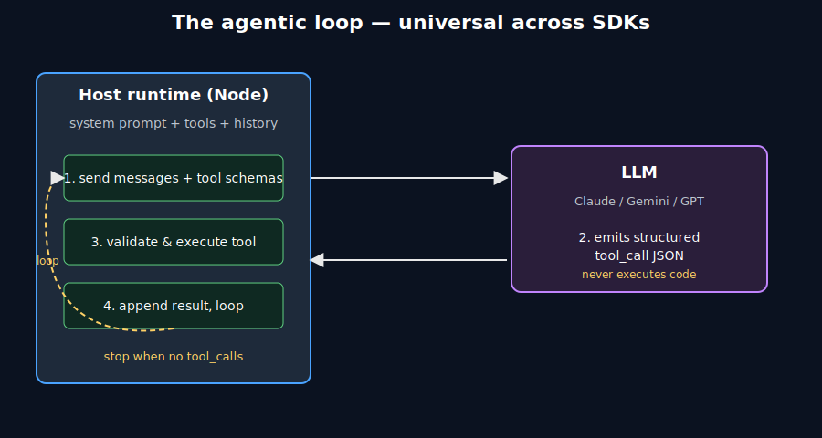
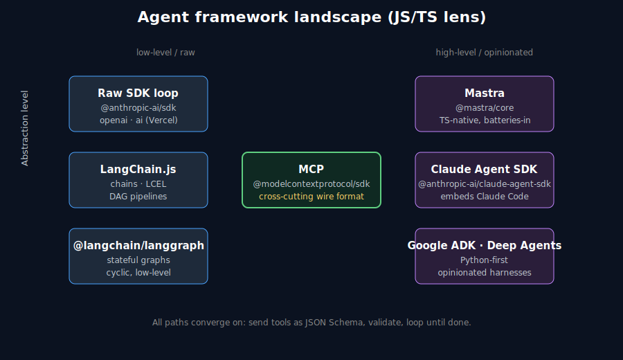
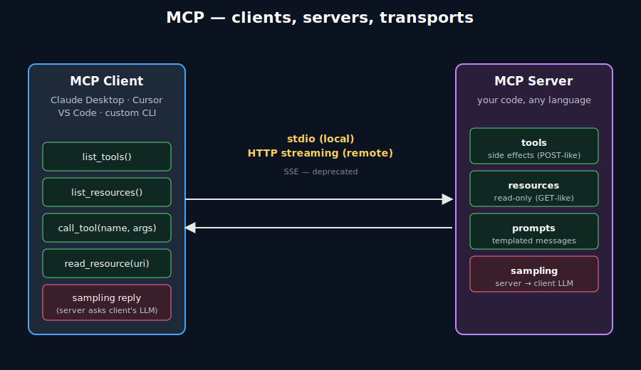
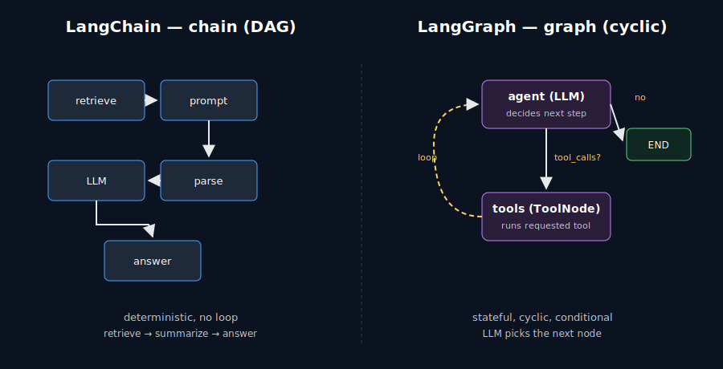
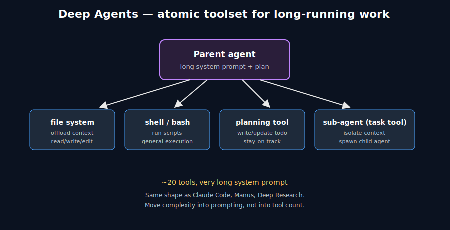
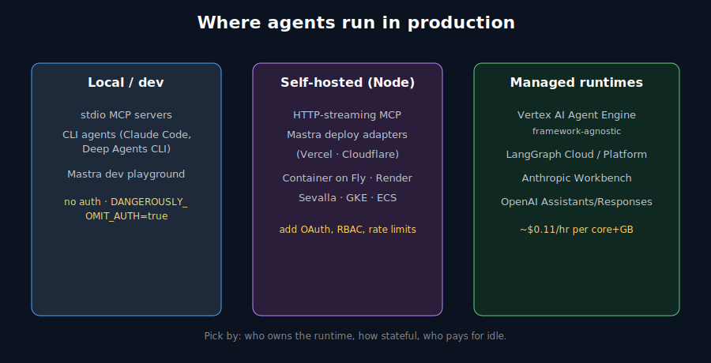

<style>
.reveal pre { width: 100%; box-shadow: none; margin: 12px auto; }
.reveal pre code {
  font-size: 0.58em;
  line-height: 1.4;
  padding: 0.6em 0.9em;
  max-height: 620px;
  border-radius: 6px;
}
.reveal :not(pre) > code { font-size: 0.78em; padding: 2px 6px; }
.reveal table { font-size: 0.55em; margin: 10px auto; }
.reveal table th, .reveal table td { padding: 6px 12px; }
.reveal ul, .reveal ol { font-size: 0.82em; }
.reveal blockquote { font-size: 0.8em; }
.reveal img { max-height: 560px; background: transparent; border: none; box-shadow: none; }
.reveal h2 { margin-bottom: 0.4em; }
.reveal section > p { font-size: 0.85em; }
</style>

# Building AI Agents in TypeScript

### Claude Agent SDK · LangGraph · Mastra · Google ADK · MCP

A core, opinionated tour for engineers new to agent frameworks.

Note: This deck synthesizes 20 YouTube sources curated in `master-summary.md`. All hands-on code is JS/TS. Python appears only where the SDK is Python-first (Google ADK, current LangGraph deep-dive material) and is clearly marked. Source: master-summary.md.

---

## How to use this deck · prerequisites

- One concept per slide. Speaker notes (`S`) cite every source.
- We assume: Node ≥ 20, TypeScript, async/await, ES modules, the basics of a chat-completions API.
- We do **not** teach Promises. We **do** teach the agentic loop.

Note: Audience: experienced software engineer, new to agent frameworks. We skip beginner explainers. Source: course design brief.

---

## What you'll leave with

1. A precise mental model of "what an agent is" that survives all five frameworks.
2. A working understanding of MCP — server, client, transports, primitives.
3. A defensible recommendation for **which framework, when**.
4. Knowledge of where each framework breaks down in production.

---

# Module 1 — What is an "agent"?

> An **agent** is an LLM in a loop that picks tools to call until a stop condition is met.

Everything else — graphs, harnesses, "deep agents", workflows — is a flavor of that loop.

Note: Tina Huang frames agents as "software systems that use AI to pursue goals on behalf of users". Zen van Riel reduces it to "a `for` loop". Both are right. Source: Tina Huang — Context Engineering Clearly Explained; Zen van Riel — Why Top AI Engineers Don't Use LangChain.

---

## The agentic loop, visualized



Note: Host code (Node) is the control center. The model returns structured tool-call JSON; your code validates, executes, appends the result, and re-invokes. Source: Zen van Riel — Why Top AI Engineers Don't Use LangChain.

---

## The crucial distinction

The **LLM never executes code**. It emits text — usually JSON — that *requests* a tool call. Your runtime decides whether to honor it.

```ts
// what the model returns is just data:
{ "tool_use": { "name": "create_user", "input": { "name": "Ada" } } }
// your code validates `input` against a schema, then runs the function.
```

This is the entire safety story. "AI going rogue" is almost always "host code didn't validate the request."

Note: Source: Zen van Riel — Why Top AI Engineers Don't Use LangChain.

---

## Six building blocks of every agent

1. **Model** — Claude, GPT, Gemini.
2. **Tools** — typed functions the model can request.
3. **Knowledge / memory** — short-term history + long-term store.
4. **I/O modes** — text, audio, vision.
5. **Guardrails** — input/output validation, permission gates.
6. **Orchestration** — deploy, monitor, replay, eval.

Note: Tina Huang's "burger" model. You don't have to instantiate them all on day one, but a production agent needs all six. Source: Tina Huang — Context Engineering Clearly Explained.

---

## Prompt eng. vs. context eng.

| Prompt engineering | Context engineering |
| --- | --- |
| One-shot chat | Long-running agents |
| Iterate verbally | Pre-design instructions |
| Tone, style, examples | Tools, memory, RAG, sub-agents |
| ChatGPT user | Agent author |

> "The LLM is the CPU; the context window is the RAM." — Karpathy, via Tina Huang.

Note: Context engineering is what fills a 100k-token window correctly when an agent runs 50 tool calls. Reach for the raw SDK when you don't need the loop at all. Source: Tina Huang — Context Engineering Clearly Explained.

---

# Module 2 — The framework landscape (TS lens)



Note: Three dimensions matter — abstraction level, TS-nativeness, and whether the framework owns the runtime. MCP cuts across all of them. Source: synthesis of master-summary.md.

---

## Five contenders we'll cover

| Framework | Native | Sweet spot |
| --- | --- | --- |
| Raw SDK loop | TS / Py | Maximum control, prod agents |
| LangChain.js | TS / Py | Linear pipelines, RAG glue |
| LangGraph (JS) | TS / Py | Stateful, cyclic workflows |
| Mastra | **TS** | Full-stack TS agent app |
| Claude Agent SDK | TS / Py | "Embed Claude Code in my app" |
| Google ADK | **Py** (TS WIP) | GCP-native, multi-model |

Note: We treat "raw SDK" as a first-class option, not a strawman. Source: synthesis.

---

## The opinionated take

- **Prototyping a TS web app?** → Mastra.
- **Embedding a coding/ops assistant?** → Claude Agent SDK.
- **Stateful workflow with branching/loops?** → LangGraph.
- **Glue for RAG/loaders/parsers?** → LangChain (modestly).
- **Production agent that has to last 18 months?** → raw SDK + MCP.
- **GCP shop, Gemini-first?** → ADK on Vertex Agent Engine.

Note: This is the single most contested question in the corpus. We're picking a side; reasoning follows in later modules. Source: synthesis of disagreements section in master-summary.md.

---

# Module 3 — The raw-SDK baseline

Every framework on the list is sugar over this loop. If you can't draw it on a napkin, the abstractions will mislead you. Octomind dropped LangChain after 12 months and replaced it with ~200 lines doing exactly this loop.

Note: Source: Zen van Riel — Why Top AI Engineers Don't Use LangChain.

---

## Minimal agent setup (TS)

```ts
import Anthropic from "@anthropic-ai/sdk";
const client = new Anthropic();

const tools = [{
  name: "get_weather",
  description: "Look up current weather for a city.",
  input_schema: {
    type: "object",
    properties: { city: { type: "string" } },
    required: ["city"],
  },
}] as const;

const toolImpls: Record<string, (args: any) => Promise<string>> = {
  get_weather: async ({ city }) => `It's sunny in ${city}.`,
};
```

Note: Tools are described to the LLM via name + description + JSON-Schema parameters — true across every framework in the corpus. Source: master-summary.md consensus.

---

## The loop itself

```ts
const messages: Anthropic.MessageParam[] = [
  { role: "user", content: "What's the weather in Lisbon?" },
];

while (true) {
  const res = await client.messages.create({
    model: "claude-sonnet-4-5",
    max_tokens: 1024,
    tools,
    messages,
  });
  messages.push({ role: "assistant", content: res.content });

  if (res.stop_reason !== "tool_use") break;

  const toolUses = res.content.filter(b => b.type === "tool_use");
  const results = await Promise.all(toolUses.map(async (tu) => ({
    type: "tool_result" as const,
    tool_use_id: tu.id,
    content: await toolImpls[tu.name](tu.input),
  })));
  messages.push({ role: "user", content: results });
}
```

Note: This *is* the loop. Everything else in the deck is a way of structuring this. Source: synthesis from Zen van Riel example + Anthropic SDK conventions.

---

## What this baseline gives — and where it hurts

- **Wins:** zero deps, provider-swappable, trivially observable, no DSL.
- **Hurts:** retries with backoff, cross-process state, streaming UI, 20 third-party tools, sub-agents, evals.

Frameworks earn their keep on the second list — **selectively**.

Note: Framing the trade-off honestly against the master-summary's "Frameworks vs. raw API" disagreement. Source: master-summary.md.

---

# Module 4 — Tool use & schemas

Every framework — Claude Agent SDK, LangChain `Tool`, MCP `server.tool`, Mastra `createTool`, ADK `FunctionTool`, raw SDK — describes tools as **name + description + JSON-Schema parameters**.

The model only ever sees those three things. The description is what selects the tool.

Note: Strong corpus-wide consensus. Source: master-summary.md.

---

## The description IS the prompt

```ts
{
  name: "send_invoice",
  // bad: "Sends an invoice."
  // good:
  description:
    "Send an invoice email to the customer of an order. Use this " +
    "ONLY after the order is confirmed paid. Do not call for refunds.",
  input_schema: { /* ... */ },
}
```

Sloppy descriptions cause the model to call tools at the wrong time. Treat each one as a mini-spec.

Note: Pulled across LangChain Master Class, Claude Agent SDK demo, Mastra demo. Source: master-summary.md consensus.

---

## Zod — the de-facto TS validator

```ts
import { z } from "zod";
import { zodToJsonSchema } from "zod-to-json-schema";

const SendInvoice = z.object({
  orderId: z.string().uuid(),
  amountCents: z.number().int().positive(),
  email: z.string().email(),
});

const input_schema = zodToJsonSchema(SendInvoice);  // for the model
const args = SendInvoice.parse(modelOutput);        // throws on bad input
```

Note: Zod prevents the model from "hallucinating parameters" — explicit in MCP Crash Course, Mastra video, Fireship MCP video. Source: master-summary.md consensus.

---

## Trust boundary & side-effect hints

- Re-authorize the user; don't trust args alone.
- Re-fetch authoritative data — don't accept it from the model.
- Apply rate limits per tool, per user.
- Log every call for replay.

```ts
// Anthropic + MCP both support side-effect hints:
{ readOnlyHint: false, destructiveHint: true,
  idempotentHint: false, openWorldHint: true }
```

Note: Hints drive UX (auto-approve reads, prompt on writes). The model is a *suggestion engine*; the host is the *security boundary*. Source: Zen van Riel + Web Dev Simplified MCP Crash Course.

---

# Module 5 — MCP, the Model Context Protocol

Before MCP: every host (Cursor, Copilot, Claude Desktop, your CLI) re-implemented "load tools from a config" differently. After MCP: one protocol, any host, any server, any language.

> "USB-C port for AI applications." — Anthropic, via Fireship.

7 of 20 corpus videos focus on MCP — the most-agreed-upon piece of infra in the bundle.

Note: Source: master-summary.md themes.

---

## MCP architecture



Note: Client lists tools/resources, calls them, optionally responds to sampling. Server publishes them. Transport is stdio (local) or HTTP streaming (remote). SSE is deprecated. Source: master-summary.md consensus.

---

## The four MCP primitives

| Primitive | Purpose | REST analogy |
| --- | --- | --- |
| Tools | Actions with side effects | POST |
| Resources | Read-only data | GET |
| Prompts | Pre-templated messages | (none) |
| Sampling | Server asks client's LLM | (inverted) |

Tools dominate. Resources are next. Prompts and sampling are niche.

Note: Source: Web Dev Simplified MCP Crash Course; codebasics MCP videos.

---

## Minimal MCP server (TS)

```ts
import { McpServer } from "@modelcontextprotocol/sdk/server/mcp";
import { StdioServerTransport } from "@modelcontextprotocol/sdk/server/stdio";
import { z } from "zod";

const server = new McpServer(
  { name: "users", version: "1.0.0" },
  { capabilities: { resources: {}, tools: {}, prompts: {} } },
);

server.tool(
  "create-user",
  "Create a new user in the database",
  { name: z.string(), email: z.string().email() },
  async ({ name, email }) => {
    const id = await createUser({ name, email });
    return { content: [{ type: "text", text: `User ${id} created.` }] };
  },
);

await server.connect(new StdioServerTransport());
```

Note: Verbatim shape from Web Dev Simplified's MCP crash course. Source: ZoZxQwp1PiM.

---

## Adding a resource

```ts
server.resource(
  "users-list",
  "users://all",
  { description: "All registered users", mimeType: "application/json" },
  async () => ({
    contents: [{
      uri: "users://all",
      mimeType: "application/json",
      text: JSON.stringify(await listUsers()),
    }],
  }),
);
```

Resources are URI-addressed. No side effects → host can fetch without permission prompts.

Note: Source: Web Dev Simplified — Ultimate MCP Crash Course.

---

## Transports & desktop wiring

| Transport | When | Auth |
| --- | --- | --- |
| **stdio** | Same machine as client | None (process boundary) |
| **HTTP streaming** | Remote / multi-tenant | OAuth, headers |
| SSE | Don't | Deprecated |

```json
// ~/Library/Application Support/Claude/claude_desktop_config.json
{ "mcpServers": {
    "users": { "command": "node", "args": ["/abs/path/dist/server.js"] }
} }
```

Same `mcpServers` shape works for VS Code, Cursor, Copilot, Roo. **Restart the host** after editing.

Note: Source: master-summary.md + Fireship MCP video + codebasics tutorial.

---

## Test with the MCP Inspector

```bash
npx @modelcontextprotocol/inspector node dist/server.js
```

Opens a local web UI — "Postman for MCP". Lists tools/resources, lets you call each, shows the JSON-RPC frames.

Use this **before** wiring into Claude Desktop. Saves hours.

Note: Universal recommendation across MCP videos. Source: master-summary.md consensus.

---

## Custom MCP client (TS)

```ts
import { Client } from "@modelcontextprotocol/sdk/client";
import { StdioClientTransport } from "@modelcontextprotocol/sdk/client/stdio";

const client = new Client({ name: "my-cli", version: "1.0.0" }, {
  capabilities: { sampling: {} },
});
await client.connect(new StdioClientTransport({
  command: "node", args: ["dist/server.js"],
}));

const { tools } = await client.listTools();
const result = await client.callTool({
  name: "create-user",
  arguments: { name: "Ada", email: "ada@example.com" },
});
```

Most teams will consume MCP through an existing host; only build a custom client when you need one.

Note: Source: Web Dev Simplified — MCP Crash Course (custom client section).

---

## MCP auth — the elephant

Tutorials use `DANGEROUSLY_OMIT_AUTH=true`. Production needs:

- Per-server identity (server token or mTLS).
- Per-tool RBAC enforced server-side.
- OAuth for user-scoped tools.
- Audit log per call.

The corpus is honest that this story is still evolving — pin versions, expect churn.

Note: Source: master-summary.md gaps section.

---

# Module 6 — Claude Agent SDK

Not "another framework." It's a TS / Python wrapper that **embeds the Claude Code runtime** — the same agent that powers the `claude` CLI — inside your app.

You get: file tools, bash, web fetch, planning, sub-agents, and MCP — for free.

Note: Mervin Praison's framing. Source: Claude Agents SDK BEATS all Agent Framework.

---

## Install & hello agent (TS)

```bash
npm i @anthropic-ai/claude-agent-sdk
npm i -g @anthropic-ai/claude-code   # SDK shells out to it
export ANTHROPIC_API_KEY=sk-ant-...
```

```ts
import { query } from "@anthropic-ai/claude-agent-sdk";

for await (const msg of query({ prompt: "Hello, how are you?" })) {
  console.log(msg);
}
```

You'll get a system message listing tools, then assistant chunks, then a usage summary.

Note: Source: i6N8oQQ0tUE.

---

## Configuring the agent

```ts
import { query, type Options } from "@anthropic-ai/claude-agent-sdk";

const options: Options = {
  systemPrompt: "You are an expert TypeScript developer.",
  cwd: "/tmp/agent-workspace",
  allowedTools: ["Read", "Write", "Bash"],
  permissionMode: "acceptEdits",  // default | acceptEdits | plan | bypassPermissions
};

for await (const msg of query({
  prompt: "Create greeting.txt with 'hello there' and read it back.",
  options,
})) console.log(msg);
```

`allowedTools`, `permissionMode`, `cwd`, `systemPrompt` are the four levers you'll touch most. Match `permissionMode` to the blast radius of the workspace.

Note: Source: i6N8oQQ0tUE.

---

## Custom tools via in-process MCP

```ts
import { tool, createSdkMcpServer, query } from "@anthropic-ai/claude-agent-sdk";
import { z } from "zod";

const greet = tool(
  "greet",
  "Greet a user by name.",
  { name: z.string() },
  async ({ name }) => ({ content: [{ type: "text", text: `Hello ${name}` }] }),
);

const myServer = createSdkMcpServer({
  name: "my_tools", version: "1.0.0", tools: [greet],
});

for await (const msg of query({
  prompt: "Greet Ada.",
  options: {
    mcpServers: { my_tools: myServer },
    allowedTools: ["mcp__my_tools__greet"],
  },
})) console.log(msg);
```

Note the `mcp__<server>__<tool>` allowlist convention.

Note: Source: i6N8oQQ0tUE.

---

## Why this is powerful

- The agent already knows file/bash/plan/sub-agent.
- You add domain tools as MCP servers (in-process or external).
- Same runtime as Claude Code — prompts and skills transfer.

If your product is "Claude Code, but for X domain" — start here.

Note: This is the disagreement with Mastra's claim. Both are right depending on goal. Source: master-summary.md disagreements.

---

# Module 7 — Mastra (TS-native, batteries included)

Single-vendor, TypeScript-first agent framework. Bundles agents, workflows, RAG, memory, MCP, evals, and observability — and a dev playground.

> "Mastra blows the Claude Agent SDK out of the water — but does it do too much?" — Better Stack.

Note: Mastra's pitch is "the Next.js of agents" — convention over configuration, full stack. The "too much" worry is real for small projects. Source: Better Stack — Mastra.

---

## Scaffold & define an agent

```bash
npx create-mastra@latest
cd my-agent && npm run dev   # playground at localhost:4111
```

```ts
// agents/financial-agent.ts
import { Agent } from "@mastra/core/agent";
import { openai } from "@ai-sdk/openai";

export const financialAgent = new Agent({
  name: "financial-agent",
  model: openai("gpt-4o"),
  instructions: `You are a personal-finance assistant.
Use getTransactions to inspect spending; answer with concrete numbers.`,
});
```

Models come from the `ai` SDK — providers are swappable.

Note: Source: Better Stack — Mastra demo.

---

## Register the agent

```ts
// src/mastra/index.ts
import { Mastra } from "@mastra/core";
import { financialAgent } from "./agents/financial-agent";

export const mastra = new Mastra({
  agents: { financialAgent },
});
```

The dev playground discovers anything registered here automatically.

Note: Source: Better Stack — Mastra demo.

---

## Custom tool with Zod

```ts
import { createTool } from "@mastra/core";
import { z } from "zod";

export const getTransactions = createTool({
  id: "getTransactions",
  description: "Fetch the user's recent transactions.",
  inputSchema: z.object({}).optional(),
  outputSchema: z.array(z.object({
    merchant: z.string(),
    amount: z.number(),
  })),
  execute: async () => fakeTransactions,
});
```

Attach via `tools: { getTransactions }` on the `Agent`.

Note: Source: Better Stack — Mastra demo.

---

## Memory + working-memory templates

```ts
import { Memory } from "@mastra/memory";
import { LibSQLStore } from "@mastra/libsql";

memory: new Memory({
  storage: new LibSQLStore({ url: "file:./memory.db" }),
  options: {
    workingMemory: {
      enabled: true,
      template: `
# User preferences
- Preferred name:
- Preferred currency:
- Risk tolerance:
`,
    },
  },
}),
```

The agent fills the template across conversations and reads it back as context. Swap LibSQL for `@mastra/pg` in prod.

Note: One of the more concrete "memory done well" patterns in the corpus. Source: Better Stack — Mastra.

---

## MCP integration in Mastra

```ts
import { MCPClient } from "@mastra/mcp";

const mcp = new MCPClient({
  servers: {
    firecrawl: {
      command: "npx",
      args: ["-y", "firecrawl-mcp"],
      env: { FIRECRAWL_API_KEY: process.env.FIRECRAWL_API_KEY! },
    },
  },
});

export const financialAgent = new Agent({
  // ...
  tools: { getTransactions, ...(await mcp.getTools()) },
});
```

You consume any MCP server (yours or third-party) the same way you consume native tools.

Note: Source: Better Stack — Mastra demo.

---

## Mastra in front of a web app

```ts
import { MastraClient } from "@mastra/client-js";

const client = new MastraClient({ baseUrl: "https://agents.example.com" });
const agent = client.getAgent("financialAgent");
const { text } = await agent.generate({
  messages: [{ role: "user", content: "How much on coffee last month?" }],
});
```

Pick Mastra for greenfield TS web apps that need memory/evals/MCP without picking 5 packages. Avoid if you need fine-grained control over the loop.

Note: Source: Better Stack — Mastra demo.

---

# Module 8 — LangChain.js

LangChain has narrowed from "do everything" to **the integration layer**: model wrappers, document loaders, output parsers, the LCEL pipe DSL.

Agentic / stateful work has moved to **LangGraph** (next module).

Note: Even the "What is LangChain?" video admits the hype has "cooled". Use it as glue. Source: master-summary.md disagreements.

---

## LCEL — pipes for runnables (TS)

```ts
import { ChatOpenAI } from "@langchain/openai";
import { ChatPromptTemplate } from "@langchain/core/prompts";
import { StringOutputParser } from "@langchain/core/output_parsers";

const prompt = ChatPromptTemplate.fromMessages([
  ["system", "You are a concise assistant."],
  ["user", "{question}"],
]);

const chain = prompt
  .pipe(new ChatOpenAI({ model: "gpt-4o" }))
  .pipe(new StringOutputParser());

const out = await chain.invoke({ question: "What is LCEL?" });
```

Note: Same pipe model as the Python `|` operator. Source: LangChain Explained in 10 Minutes; LangChain Master Class.

---

## Tools, parallel, branches

```ts
import { DynamicStructuredTool } from "@langchain/core/tools";
import { RunnableParallel, RunnableBranch } from "@langchain/core/runnables";
import { z } from "zod";

const wikiTool = new DynamicStructuredTool({
  name: "wikipedia",
  description: "Search Wikipedia for a topic.",
  schema: z.object({ topic: z.string() }),
  func: async ({ topic }) => searchWiki(topic),
});

const fanout = RunnableParallel.from({ summary: summarizeChain, keywords: kwChain });
const router = RunnableBranch.from([
  [(i) => i.lang === "es", spanishChain],
  englishChain,  // default
]);
```

For deterministic, branching DAGs without a state graph, this is plenty.

Note: Source: LangChain Master Class.

---

## When LangChain.js stops being enough

- Stateful loops with conditional re-entry.
- Pause/resume, human-in-the-loop interrupts.
- Multi-agent supervisor patterns.
- Time-travel debugging.

Cross over to LangGraph at that point. Strong corpus consensus: **chains for DAGs, graphs for cycles.**

Note: Source: master-summary.md consensus.

---

# Module 9 — LangGraph



Note: LangChain is a directed acyclic chain. LangGraph is a state machine: nodes, edges, conditional edges, looping. Source: IBM — LangChain vs LangGraph.

---

## The model

- **State** — typed object passed between nodes.
- **Nodes** — pure functions: `(state) => Partial<state>`.
- **Edges** — fixed transitions.
- **Conditional edges** — function picks the next node from state.
- **Compile** — produces a runnable graph with checkpoints.

Note: This mirrors LangGraph Python. Source: KodeKloud — LangGraph Explained for Beginners; freeCodeCamp LangGraph course.

---

## ReAct agent in LangGraph.js — tools & model

```ts
import { StateGraph, END, MessagesAnnotation } from "@langchain/langgraph";
import { ToolNode } from "@langchain/langgraph/prebuilt";
import { ChatAnthropic } from "@langchain/anthropic";
import { tool } from "@langchain/core/tools";
import { z } from "zod";

const getWeather = tool(
  async ({ city }) => `It's sunny in ${city}.`,
  {
    name: "get_weather",
    description: "Look up current weather for a city.",
    schema: z.object({ city: z.string() }),
  },
);

const model = new ChatAnthropic({ model: "claude-sonnet-4-5" })
  .bindTools([getWeather]);
```

Note: TS port of the master-summary Python ReAct example. Source: master-summary example 4.

----

## Wiring the graph

```ts
const callModel = async (state: typeof MessagesAnnotation.State) => ({
  messages: [await model.invoke(state.messages)],
});

const shouldContinue = (state: typeof MessagesAnnotation.State) => {
  const last = state.messages.at(-1) as any;
  return last?.tool_calls?.length ? "tools" : END;
};

const graph = new StateGraph(MessagesAnnotation)
  .addNode("agent", callModel)
  .addNode("tools", new ToolNode([getWeather]))
  .addEdge("__start__", "agent")
  .addConditionalEdges("agent", shouldContinue, ["tools", END])
  .addEdge("tools", "agent")
  .compile();

const result = await graph.invoke({
  messages: [{ role: "user", content: "Weather in Lisbon?" }],
});
```

This *is* the agentic loop, expressed as a graph. The conditional edge is the loop condition.

Note: Source: synthesis from master-summary example 4.

---

## Checkpoints & human-in-the-loop

```ts
import { MemorySaver, interrupt } from "@langchain/langgraph";

const checkpointer = new MemorySaver();   // swap for PostgresSaver in prod
const graph = builder.compile({ checkpointer });

await graph.invoke(
  { messages: [{ role: "user", content: "..." }] },
  { configurable: { thread_id: "user-42" } },
);

// inside any node:
const decision = interrupt({ question: "Approve send?", draft: state.draftEmail });
```

Threads = conversation IDs. The graph pauses at `interrupt()`; your UI inspects the checkpoint, gathers human input, resumes with `Command.resume`.

Note: Canonical pattern for review-required agents. Source: 1Q_MDOWaljk; freeCodeCamp Drafter project.

---

## When to pick (or skip) LangGraph

**Pick when:** branching/looping workflows, human approval gates, multi-agent shared state, pause/resume/replay.

**Skip when:** tiny one-shot tasks (raw SDK), TS web focus (Mastra), heavy MCP tooling (use the MCP SDK directly).

Don't reach for a state machine when a function will do.

Note: Source: synthesis.

---

# Module 10 — Deep Agents

Long-running agents — Claude Code, Manus, Deep Research — that complete tasks involving 50+ tool calls. LangChain's **Deep Agents** package is an opinionated harness for building them.

> "The length of tasks an agent can take on is doubling every seven months."



Note: All long-running agents converge on these four primitives. Move complexity into prompting, not into tool count. Source: IVts6ztrkFg.

---

## The atomic toolkit, why these four

| Tool | Why |
| --- | --- |
| File system | Offload context out of the window |
| Shell / bash | Execute scripts, glue actions |
| Planning | Track progress over long horizons |
| Sub-agents | Isolate context per subtask |

Plus a very long system prompt. Claude Code has <20 tools.

Note: Source: IVts6ztrkFg.

---

## Deep Agents in TS today

The Deep Agents package is **Python-first**. To get this pattern in TS:

1. Build it on LangGraph.js.
2. Use the **Claude Agent SDK** — it already ships file/bash/plan/sub-agent.
3. Build it on Mastra workflows + tools.

```ts
// Claude Agent SDK already gives you the deep-agent toolkit:
options: {
  cwd: process.cwd(),
  allowedTools: ["Read", "Write", "Edit", "Bash", "Grep", "Task"],
  permissionMode: "acceptEdits",
}
// `Task` = sub-agent delegation with isolated context.
```

Note: Honest gap; corpus calls it out explicitly. Source: master-summary.md gaps + Mervin Praison.

---

# Module 11 — Google ADK + Vertex Agent Engine

Google's **Agent Development Kit**: an SDK for defining agents, plus **Vertex AI Agent Engine** as a managed runtime.

- Multi-model (Gemini, Claude, GPT).
- Framework-agnostic runtime — also runs LangChain, CrewAI, LlamaIndex.
- Pricing ≈ $0.11/hr per core+GB.
- **Python-first** today; TS support is partial.

Note: Source: aiwithbrandon — Google ADK + Vertex AI Agent Engine.

---

## Python ADK agent (reference)

```python
# appendix-only Python — TS path covered separately
from google.adk.agents import LlmAgent
from google.adk.tools import FunctionTool

def get_stock_price(ticker: str) -> dict:
    """Return the current price for a stock ticker."""
    ...

root_agent = LlmAgent(
    name="finance_agent",
    model="gemini-2.0-flash",
    instruction="Answer finance questions using get_stock_price.",
    tools=[FunctionTool(func=get_stock_price)],
)
```

Note: Verbatim shape from the ADK demo. The TS SDK shape will mirror this. Source: bPtKnDIVEsg.

---

## Calling a deployed ADK agent from Node

```ts
const res = await fetch(`${ADK_URL}/agents/finance_agent:run`, {
  method: "POST",
  headers: {
    "Authorization": `Bearer ${await getGoogleIdToken(ADK_URL)}`,
    "Content-Type": "application/json",
  },
  body: JSON.stringify({
    session_id: "user-42",
    input: { content: "AAPL price?" },
  }),
});
const { content } = await res.json();
```

Pragmatic TS path: keep the agent in Python, call it as a service. Pick ADK if you're on GCP, need Gemini's long context, or want a managed runtime.

Note: Source: synthesis of bPtKnDIVEsg + Vertex Agent Engine conventions.

---

# Module 12 — Memory & persistence

| Layer | Lifetime | Example |
| --- | --- | --- |
| **Working** (in-context) | Within one run | scratch pad, plan, partial results |
| **Session** | Per conversation | message history with `add_messages` reducer |
| **Long-term** | Cross-session | preferences, prior decisions, embeddings |

Each framework gives you primitives for all three; storage is your choice.

Note: Source: synthesis of Mastra, LangGraph, LangChain Master Class.

---

## Session memory — the `add_messages` reducer

LangGraph and Mastra both use the same idea: messages append, dedup by `id`, tool-result reconciliation.

```ts
const MessagesAnnotation = Annotation.Root({
  messages: Annotation<BaseMessage[]>({
    reducer: (a, b) => addMessages(a, b),
    default: () => [],
  }),
});
```

Don't reinvent this. Reach for the helper. RAG over docs is out of scope for this course; Mastra has `@mastra/rag`, LangChain has loaders/retrievers, both call a vector DB at the end.

Note: Source: freeCodeCamp LangGraph; Mastra Memory class; master-summary.md (RAG mention).

---

# Module 13 — Context engineering

| Lever | What you do |
| --- | --- |
| **Write** | Agent records info to a scratchpad / file system |
| **Select** | Pull the right slice from memory or docs |
| **Compress** | Summarize older turns when the window fills |
| **Isolate** | Split context across sub-agents |

Each lever maps to concrete code: tool calls, retrievers, summarization nodes, sub-agent spawns.

Note: Source: jLuwLJBQkIs — Tina Huang citing LangChain blog.

---

## Structure your system prompt

```text
<role>
You are an AI research assistant.
</role>

<task>
1. Decompose the query (delimited by <user_query>) into 10 subtasks.
2. Prioritize by engagement and source authority.
3. Emit JSON per <output_schema/>.
</task>

<output_schema>
{ "id": int, "query": str, "source_type": "...", ... }
</output_schema>

<constraints>
- No personal opinions.
- Skip background/fluff.
</constraints>
```

XML tags + clear sections beat a wall of paragraphs.

Note: Pattern works across Claude, GPT, Gemini. Source: Tina Huang — Context Engineering.

---

## Prompt caching is real money

Most providers cache static prefixes. For a long system prompt + small user turn, **cached input is ~10× cheaper** than fresh tokens.

- Anthropic: `cache_control` on system block.
- OpenAI: automatic prefix caching.
- Mastra / Claude Agent SDK: enabled by default.

Put your long system prompt at the top, *then* the variable parts.

Note: Source: IVts6ztrkFg + Anthropic docs.

---

# Module 14 — Multi-agent patterns

Almost never needed on day one. But three patterns recur:

- **Supervisor → workers** — one agent routes to specialists.
- **Pipeline** — A's output feeds B (deterministic).
- **Debate / panel** — agents argue; arbiter picks.

Cognition's two principles:

1. **Always share context between agents.**
2. **Actions carry implicit decisions** — be careful at every branch.

Don't isolate sub-agents to the point that the parent can't reconstruct what happened. Audit logs across agents are non-negotiable.

Note: Source: jLuwLJBQkIs (Cognition) + master-summary.md gaps.

---

# Module 15 — Evals & observability

Unit tests prove a function works. Evals prove a *probabilistic system* still works after a prompt/model/tool change. Three eval shapes:

| Shape | Question | Output |
| --- | --- | --- |
| Trajectory | Right path? | Tool-call sequence diff |
| Final answer | Right result? | LLM-as-judge / golden output |
| Cost / latency | Too expensive? | tokens, $, ms per run |

LangChain/LangGraph → LangSmith. Mastra → built-in `evals`. Claude Agent SDK → pipe messages to any tracer. Raw SDK → roll it; OpenTelemetry + JSONL gets you 80%.

Note: Source: synthesis from ldBsvhjEREc + Mastra.

---

## A minimal trace, by hand

```ts
type Trace = {
  id: string;
  agent: string;
  events: Array<
    | { kind: "model_call"; ms: number; tokensIn: number; tokensOut: number }
    | { kind: "tool_call"; name: string; ms: number; ok: boolean }
    | { kind: "final"; text: string }
  >;
};

// append on every step; flush to JSONL on finish.
```

You can't fix what you can't see. Start with this even if you adopt a SaaS later.

Note: Source: synthesis.

---

# Module 16 — Deployment patterns



Note: Three buckets: local dev, self-hosted, managed runtime. The decision tree is mostly: "who owns idle compute and identity?" Source: synthesis from bPtKnDIVEsg + master-summary.md.

---

## Self-hosted Node — Mastra & MCP HTTP

```ts
// mastra.config.ts
export default defineConfig({
  deployer: new VercelDeployer(),  // or CloudflareDeployer, NodeDeployer
});
```

```ts
// MCP server over HTTP streaming
import express from "express";
import { StreamableHTTPServerTransport } from
  "@modelcontextprotocol/sdk/server/streamableHttp";

const app = express();
app.post("/mcp", async (req, res) => {
  const transport = new StreamableHTTPServerTransport({
    sessionIdGenerator: () => crypto.randomUUID(),
  });
  await server.connect(transport);
  await transport.handleRequest(req, res, req.body);
});
app.listen(3000);
```

Add OAuth in front. Don't ship without it.

Note: Source: Better Stack — Mastra; MCP HTTP streaming docs + crash courses.

---

## Managed runtimes & decision

| You... | Pick |
| --- | --- |
| Have a Node web app | Vercel/Cloudflare + Mastra or raw |
| Need long-running, stateful | LangGraph Cloud / Platform |
| Are GCP/Gemini | Vertex AI Agent Engine |
| Are local-first dev tool | Claude Agent SDK CLI |
| Are scaling tools across teams | Self-host MCP servers |

Vertex Agent Engine is framework-agnostic (≈$0.11/hr per core+GB). LangGraph Platform is tightly coupled to LangSmith for traces.

Note: Source: synthesis from bPtKnDIVEsg + ldBsvhjEREc.

---

# Module 17 — Do I even need a framework?

**Against:** wrong mental model, abstracts the loop you'll debug, vendor lock-in. *Octomind dropped LangChain after 12 months; their code got simpler and cheaper.* "It's really just a `for` loop with JSON-defined function calls."

**For:** provider portability, memory/persistence/streaming/evals out of the box, battle-tested integrations, faster prototype.

The honest answer is **time horizon**.

Note: Source: master-summary.md disagreements + Zen van Riel.

---

## Our recommendation

| Time horizon | Pick |
| --- | --- |
| Demo / hackathon | Mastra or Claude Agent SDK |
| 3-month prototype | LangGraph or Mastra |
| 18-month production | Raw SDK + MCP, framework only where it earns its keep |

The longer you'll own it, the less abstraction you want.

Note: This is the deck's opinionated answer to the corpus's central disagreement. Source: master-summary.md disagreements.

---

# Module 18 — Putting it together

```text
┌──────────────────────────────────────┐
│  Your Node app (Next.js / Fastify)   │
│  • Auth, rate limits, billing        │
│  • Loop runner (raw SDK or Mastra)   │
│  • Tool gateway → MCP clients        │
└──────┬───────────────────────────────┘
       │ MCP (stdio or HTTP streaming)
       ▼
┌──────────────────────────────────────┐
│  MCP servers — one per domain        │
│  (CRM, calendar, internal APIs, …)   │
└──────────────────────────────────────┘
```

Loop is yours. Domain integrations are MCP servers. Easy to swap models or add hosts.

Note: Source: synthesis.

---

## Code shape & migration order

```ts
const mcp = new MCPClient({
  servers: {
    crm: { command: "node", args: ["mcp-crm/dist/server.js"] },
    cal: { command: "node", args: ["mcp-cal/dist/server.js"] },
  },
});

const support = new Agent({
  name: "support",
  model: anthropic("claude-sonnet-4-5"),
  instructions: SUPPORT_SYSTEM_PROMPT,
  tools: { ...(await mcp.getTools()) },
  memory: new Memory({ storage: new PgStore({ url: PG_URL }) }),
});
```

**Migration order:** (1) extract tools to MCP servers; (2) replace loop runner; (3) move memory/eval glue last. MCP-first migration de-risks the rest.

Note: Identifies a corpus gap and gives a defensible plan. Source: master-summary.md gaps.

---

# Beyond this course

What we did **not** cover:

- Fine-tuning / model training — out of scope.
- RAG infrastructure & vector DBs in depth — mentioned only.
- Native Deep Agents in TS — package is Python-first today.
- Streaming UI patterns — corpus didn't demo any.
- MCP auth / OAuth in depth — story still evolving.
- Cost & latency benchmarks across SDKs — no head-to-head data.
- Multi-agent in production — name-checked, not walked through end-to-end.

Note: Calling out gaps explicitly so the deck doesn't pretend completeness. Source: master-summary.md gaps.

---

## Where to go next

- Build the raw-SDK loop from Module 3 once. Feel the loop.
- Stand up one MCP server for a real domain you own.
- Pick **one** framework (Mastra or LangGraph) and port the loop.
- Add evals before adding features.
- Read the LangChain "context engineering" post; read Cognition's multi-agent post.

Note: Source: synthesis.

---

# Appendix A — Python parity

Where the SDK is Python-first today:

- **Google ADK** — TS partial; deploy Python agents to Vertex Agent Engine, call from Node over HTTPS (Module 11).
- **LangGraph** — JS package tracks Python closely but lags niche features. Polyglot teams: prototype Python, productionize JS once needed APIs are stable.
- **Deep Agents** — Python only. In TS, replicate via LangGraph.js + file/bash/Task tools — or just use Claude Agent SDK.

```python
# Deep Agents reference
from deepagents import create_deep_agent
agent = create_deep_agent(tools=[search_web], instructions="...")
```

Note: Honest gap callouts. Source: master-summary.md gaps + IVts6ztrkFg + bPtKnDIVEsg.

---

# Appendix B — Quick reference

| Need | Package |
| --- | --- |
| Anthropic raw | `@anthropic-ai/sdk` |
| OpenAI raw | `openai` |
| Multi-provider | `ai` + `@ai-sdk/openai`, `@ai-sdk/anthropic`, `@ai-sdk/google` |
| Claude Agent SDK | `@anthropic-ai/claude-agent-sdk` |
| Mastra | `@mastra/core`, `@mastra/memory`, `@mastra/mcp`, `@mastra/libsql` |
| LangChain | `@langchain/core`, `@langchain/openai`, `@langchain/anthropic` |
| LangGraph | `@langchain/langgraph` |
| MCP | `@modelcontextprotocol/sdk` |
| Schemas | `zod`, `zod-to-json-schema` |

| Command | Does |
| --- | --- |
| `npx create-mastra@latest` | Scaffold Mastra project |
| `npx @modelcontextprotocol/inspector <cmd>` | Open MCP test UI |
| `claude` | Run Claude Code interactively |
| `npx reveal-md course.md --watch` | Render this deck |

Note: Source: synthesis.

---

## Mental-model checklist

- [ ] Can I draw the agentic loop without notes?
- [ ] Do I know stdio vs. HTTP for my MCP servers?
- [ ] Are my tool descriptions written for the model, not the human?
- [ ] Is every tool input validated with Zod?
- [ ] Do I have a trace JSONL on every run?
- [ ] Did I pick a framework on a defensible time horizon?

If yes to all six, you're ahead of most teams.

Note: Source: synthesis.

---

# Appendix C — Source attribution

| # | Title | Channel |
| --- | --- | --- |
| 1 | [Agentic Framework LangGraph explained in 8 minutes](https://www.youtube.com/watch?v=1Q_MDOWaljk) | W.W. AI Adventures |
| 2 | [What is LangChain?](https://www.youtube.com/watch?v=1bUy-1hGZpI) | IBM Technology |
| 3 | [Claude's Model Context Protocol is here](https://www.youtube.com/watch?v=HyzlYwjoXOQ) | Fireship |
| 4 | [What are Deep Agents?](https://www.youtube.com/watch?v=IVts6ztrkFg) | LangChain |
| 5 | [MCP Tutorial: Build Your First MCP Server and Client](https://www.youtube.com/watch?v=RhTiAOGwbYE) | KodeKloud |
| 6 | [The Ultimate MCP Crash Course](https://www.youtube.com/watch?v=ZoZxQwp1PiM) | Web Dev Simplified |
| 7 | [Mastra: The AI Framework That Changes Everything](https://www.youtube.com/watch?v=_dG8iZgmicQ) | Better Stack |
| 8 | [Google ADK: Deploy Your First Agent to Vertex AI](https://www.youtube.com/watch?v=bPtKnDIVEsg) | aiwithbrandon |
| 9 | [LangGraph Explained for Beginners](https://www.youtube.com/watch?v=cUfLrn3TM3M) | KodeKloud |
| 10 | [What is MCP? Integrate AI Agents with Databases & APIs](https://www.youtube.com/watch?v=eur8dUO9mvE) | IBM Technology |

---

## Source attribution (cont.)

| # | Title | Channel |
| --- | --- | --- |
| 11 | [Claude Agents SDK BEATS all Agent Framework!](https://www.youtube.com/watch?v=i6N8oQQ0tUE) | Mervin Praison |
| 12 | [LangGraph Complete Course for Beginners](https://www.youtube.com/watch?v=jGg_1h0qzaM) | freeCodeCamp.org |
| 13 | [MCP Tutorial: Build Your First MCP Server](https://www.youtube.com/watch?v=jLM6n4mdRuA) | codebasics |
| 14 | [Context Engineering Clearly Explained](https://www.youtube.com/watch?v=jLuwLJBQkIs) | Tina Huang |
| 15 | [LangGraph vs LangChain vs LangFlow vs LangSmith](https://www.youtube.com/watch?v=ldBsvhjEREc) | FuturMinds |
| 16 | [LangChain vs LangGraph: A Tale of Two Frameworks](https://www.youtube.com/watch?v=qAF1NjEVHhY) | IBM Technology |
| 17 | [Model Context Protocol Clearly Explained](https://www.youtube.com/watch?v=tzrwxLNHtRY) | codebasics |
| 18 | [Why Top AI Engineers Don't Use LangChain](https://www.youtube.com/watch?v=uR_lvAZFBw0) | Zen van Riel |
| 19 | [LangChain Explained in 10 Minutes](https://www.youtube.com/watch?v=xTmU8ZImUO8) | KodeKloud |
| 20 | [LangChain Master Class For Beginners 2024](https://www.youtube.com/watch?v=yF9kGESAi3M) | aiwithbrandon |

---

## Thank you

Questions?

```bash
npx reveal-md course.md --watch
```

Source bundle: `markdown/`, `master-summary.md`, `assets/`.

Note: End of deck. Press `?` for reveal.js keyboard shortcuts. Source: research-to-course skill.
